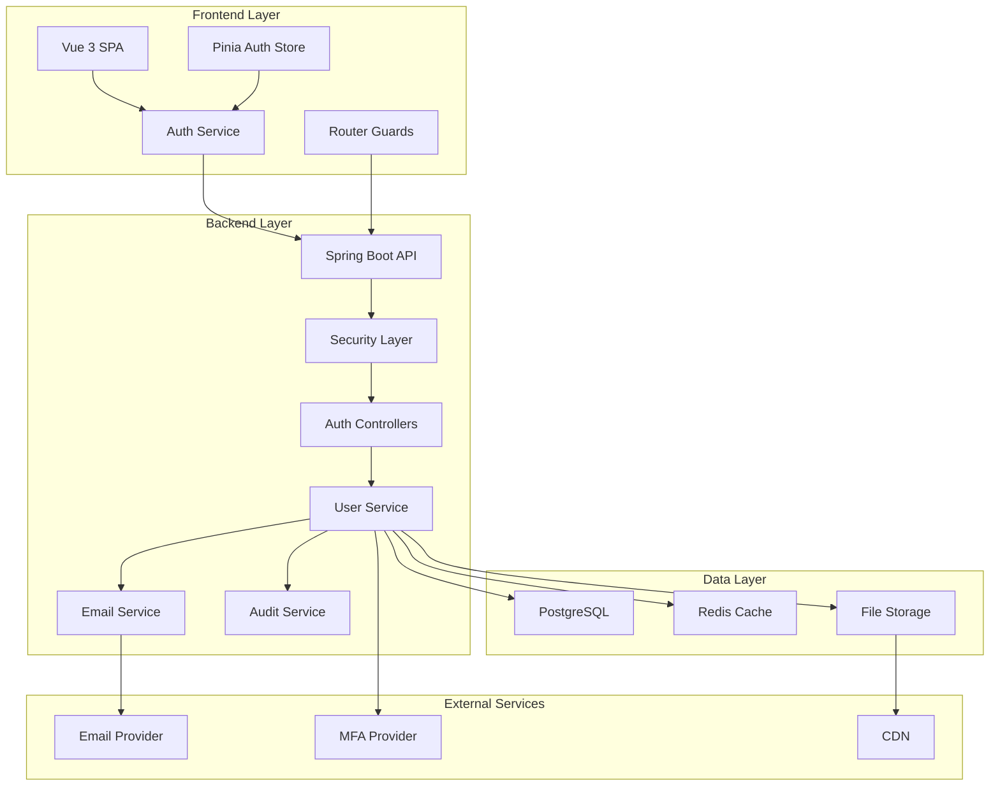
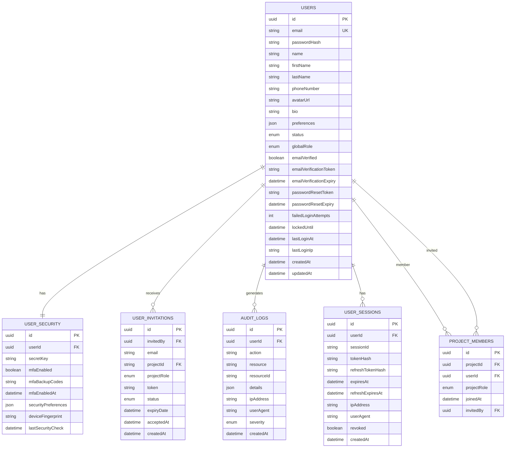
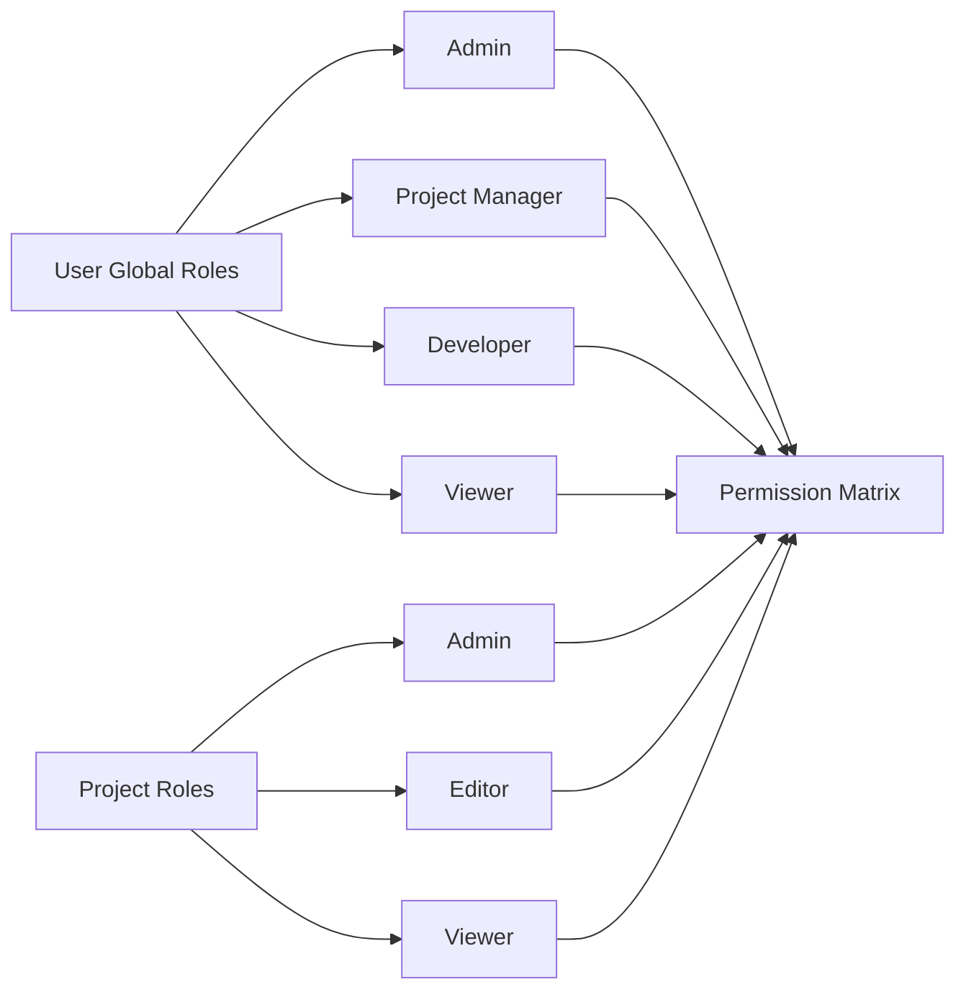
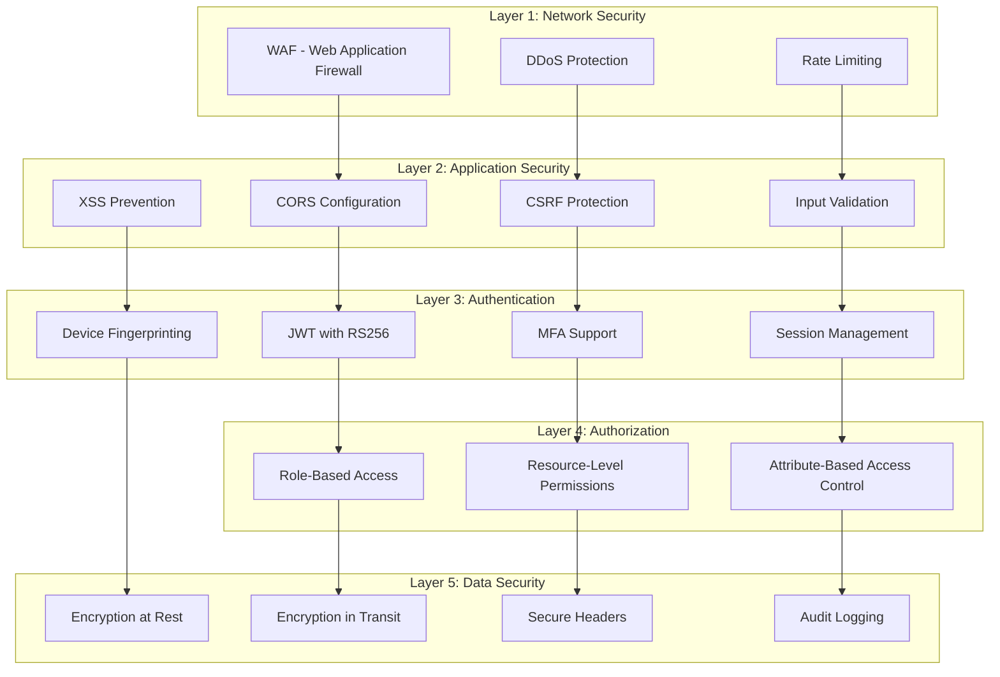

# Lineage Account Management System Architecture

## Table of Contents
1. [System Overview](#system-overview)
2. [Database Schema Design](#database-schema-design)
3. [API Endpoint Specifications](#api-endpoint-specifications)
4. [Frontend Component Architecture](#frontend-component-architecture)
5. [Security Implementation Strategy](#security-implementation-strategy)
6. [Session Management Approach](#session-management-approach)
7. [File Organization and Naming Conventions](#file-organization-and-naming-conventions)
8. [Integration Points with Existing Lineage Features](#integration-points-with-existing-lineage-features)
9. [Deployment Considerations](#deployment-considerations)
10. [Security Vulnerability Mitigation](#security-vulnerability-mitigation)

---

## System Overview

### Component Interaction Diagram



### Current State Analysis

**Existing Implementation:**
- Basic JWT authentication with Spring Security
- User entity with UUID, email, passwordHash, name, role
- UserRole: VIEWER, EDITOR, ADMIN
- ProjectRole: VIEWER, EDITOR, ADMIN  
- ProjectMember entity for project-specific roles
- Stateless session management with BCryptPasswordEncoder

**Enhanced Requirements:**
- Extended role system (Admin, Project Manager, Developer, Viewer)
- Email verification and MFA support
- Advanced security features (login attempts, audit trails)
- Profile management with avatars and preferences
- User invitation system
- Account lifecycle management

---

## Database Schema Design

### Enhanced Entity Relationships



### Enhanced Role System



### Database Migration Strategy

```sql
-- Migration: V001__Enhanced_User_Management.sql

-- Add new columns to existing users table
ALTER TABLE users 
ADD COLUMN first_name VARCHAR(100),
ADD COLUMN last_name VARCHAR(100),
ADD COLUMN phone_number VARCHAR(20),
ADD COLUMN avatar_url VARCHAR(255),
ADD COLUMN bio TEXT,
ADD COLUMN preferences JSONB,
ADD COLUMN status VARCHAR(20) DEFAULT 'ACTIVE',
ADD COLUMN global_role VARCHAR(20) DEFAULT 'VIEWER',
ADD COLUMN email_verified BOOLEAN DEFAULT FALSE,
ADD COLUMN email_verification_token VARCHAR(255),
ADD COLUMN email_verification_expiry TIMESTAMP,
ADD COLUMN password_reset_token VARCHAR(255),
ADD COLUMN password_reset_expiry TIMESTAMP,
ADD COLUMN failed_login_attempts INTEGER DEFAULT 0,
ADD COLUMN locked_until TIMESTAMP,
ADD COLUMN last_login_at TIMESTAMP,
ADD COLUMN last_login_ip INET;

-- Update existing role constraint
ALTER TABLE users DROP CONSTRAINT IF EXISTS users_role_check;
ALTER TABLE users ADD CONSTRAINT users_role_check 
CHECK (global_role IN ('ADMIN', 'PROJECT_MANAGER', 'DEVELOPER', 'VIEWER'));

-- Create new tables
CREATE TABLE user_security (
    id UUID PRIMARY KEY DEFAULT gen_random_uuid(),
    user_id UUID NOT NULL REFERENCES users(id) ON DELETE CASCADE,
    secret_key VARCHAR(255),
    mfa_enabled BOOLEAN DEFAULT FALSE,
    mfa_backup_codes TEXT,
    mfa_enabled_at TIMESTAMP,
    security_preferences JSONB DEFAULT '{}',
    device_fingerprint VARCHAR(255),
    last_security_check TIMESTAMP DEFAULT NOW(),
    created_at TIMESTAMP DEFAULT NOW(),
    updated_at TIMESTAMP DEFAULT NOW()
);

CREATE TABLE user_invitations (
    id UUID PRIMARY KEY DEFAULT gen_random_uuid(),
    invited_by UUID NOT NULL REFERENCES users(id),
    email VARCHAR(255) NOT NULL,
    project_id UUID REFERENCES projects(id),
    project_role VARCHAR(20) CHECK (project_role IN ('ADMIN', 'EDITOR', 'VIEWER')),
    token VARCHAR(255) NOT NULL UNIQUE,
    status VARCHAR(20) DEFAULT 'PENDING' CHECK (status IN ('PENDING', 'ACCEPTED', 'EXPIRED', 'CANCELLED')),
    expiry_date TIMESTAMP NOT NULL,
    accepted_at TIMESTAMP,
    created_at TIMESTAMP DEFAULT NOW()
);

CREATE TABLE audit_logs (
    id UUID PRIMARY KEY DEFAULT gen_random_uuid(),
    user_id UUID REFERENCES users(id),
    action VARCHAR(100) NOT NULL,
    resource VARCHAR(100),
    resource_id VARCHAR(255),
    details JSONB,
    ip_address INET,
    user_agent TEXT,
    severity VARCHAR(20) DEFAULT 'INFO' CHECK (severity IN ('INFO', 'WARNING', 'ERROR', 'CRITICAL')),
    created_at TIMESTAMP DEFAULT NOW()
);

CREATE TABLE user_sessions (
    id UUID PRIMARY KEY DEFAULT gen_random_uuid(),
    user_id UUID NOT NULL REFERENCES users(id) ON DELETE CASCADE,
    session_id VARCHAR(255) NOT NULL UNIQUE,
    token_hash VARCHAR(255) NOT NULL,
    refresh_token_hash VARCHAR(255),
    expires_at TIMESTAMP NOT NULL,
    refresh_expires_at TIMESTAMP,
    ip_address INET,
    user_agent TEXT,
    revoked BOOLEAN DEFAULT FALSE,
    created_at TIMESTAMP DEFAULT NOW()
);

-- Create indexes for performance
CREATE INDEX idx_users_email ON users(email);
CREATE INDEX idx_users_status ON users(status);
CREATE INDEX idx_users_global_role ON users(global_role);
CREATE INDEX idx_user_security_user_id ON user_security(user_id);
CREATE INDEX idx_audit_logs_user_id ON audit_logs(user_id);
CREATE INDEX idx_audit_logs_created_at ON audit_logs(created_at);
CREATE INDEX idx_user_sessions_user_id ON user_sessions(user_id);
CREATE INDEX idx_user_sessions_session_id ON user_sessions(session_id);
```

---

## API Endpoint Specifications

### Authentication Endpoints

| Method | Endpoint | Description | Auth Required | Rate Limit |
|--------|----------|-------------|---------------|------------|
| POST | `/api/auth/register` | User registration | No | 5/min per IP |
| POST | `/api/auth/login` | User login | No | 10/min per IP |
| POST | `/api/auth/logout` | User logout | Yes | 30/min |
| POST | `/api/auth/refresh` | Refresh access token | No | 20/min per IP |
| POST | `/api/auth/verify-email` | Verify email address | No | 10/min per IP |
| POST | `/api/auth/resend-verification` | Resend verification email | No | 3/min per IP |
| POST | `/api/auth/forgot-password` | Request password reset | No | 5/min per IP |
| POST | `/api/auth/reset-password` | Reset password with token | No | 10/min per IP |
| GET | `/api/auth/me` | Get current user | Yes | 60/min |
| POST | `/api/auth/change-password` | Change password | Yes | 10/min |

### User Management Endpoints

| Method | Endpoint | Description | Auth Required | Role Required |
|--------|----------|-------------|---------------|---------------|
| GET | `/api/users/profile` | Get user profile | Yes | Any |
| PUT | `/api/users/profile` | Update user profile | Yes | Any |
| POST | `/api/users/upload-avatar` | Upload user avatar | Yes | Any |
| DELETE | `/api/users/avatar` | Delete user avatar | Yes | Any |
| GET | `/api/users/preferences` | Get user preferences | Yes | Any |
| PUT | `/api/users/preferences` | Update user preferences | Yes | Any |
| POST | `/api/users/enable-mfa` | Enable MFA | Yes | Any |
| POST | `/api/users/verify-mfa` | Verify MFA setup | Yes | Any |
| POST | `/api/users/disable-mfa` | Disable MFA | Yes | Any |
| GET | `/api/users/backup-codes` | Get MFA backup codes | Yes | Any |
| POST | `/api/users/generate-backup-codes` | Generate new backup codes | Yes | Any |

### Admin Endpoints

| Method | Endpoint | Description | Auth Required | Role Required |
|--------|----------|-------------|---------------|---------------|
| GET | `/api/admin/users` | List all users | Yes | ADMIN |
| GET | `/api/admin/users/:id` | Get user details | Yes | ADMIN |
| PUT | `/api/admin/users/:id` | Update user | Yes | ADMIN |
| DELETE | `/api/admin/users/:id` | Delete/deactivate user | Yes | ADMIN |
| POST | `/api/admin/users/:id/lock` | Lock user account | Yes | ADMIN |
| POST | `/api/admin/users/:id/unlock` | Unlock user account | Yes | ADMIN |
| GET | `/api/admin/audit-logs` | Get audit logs | Yes | ADMIN |
| GET | `/api/admin/statistics` | Get system statistics | Yes | ADMIN |
| POST | `/api/admin/create-user` | Create user (admin) | Yes | ADMIN |

### User Invitation Endpoints

| Method | Endpoint | Description | Auth Required | Role Required |
|--------|----------|-------------|---------------|---------------|
| POST | `/api/invitations/send` | Send user invitation | Yes | Project Manager+ |
| GET | `/api/invitations/:token` | Get invitation details | No | None |
| POST | `/api/invitations/:token/accept` | Accept invitation | No | None |
| GET | `/api/invitations/my-invitations` | Get user's invitations | Yes | Any |
| DELETE | `/api/invitations/:id` | Cancel invitation | Yes | Project Manager+ |

### Request/Response Examples

#### User Registration
```typescript
// POST /api/auth/register
interface RegisterRequest {
  email: string;
  password: string;
  firstName: string;
  lastName: string;
  phoneNumber?: string;
}

// Response
interface RegisterResponse {
  success: boolean;
  message: string;
  userId: string;
  emailVerificationRequired: boolean;
}
```

#### User Profile Update
```typescript
// PUT /api/users/profile
interface ProfileUpdateRequest {
  firstName?: string;
  lastName?: string;
  phoneNumber?: string;
  bio?: string;
  preferences?: {
    theme: 'light' | 'dark' | 'system';
    language: string;
    notifications: {
      email: boolean;
      browser: boolean;
      security: boolean;
    };
  };
}

// Response
interface ProfileResponse {
  id: string;
  email: string;
  firstName: string;
  lastName: string;
  phoneNumber?: string;
  avatarUrl?: string;
  bio?: string;
  preferences: UserPreferences;
  globalRole: UserRole;
  status: UserStatus;
  createdAt: string;
  updatedAt: string;
}
```

---

## Frontend Component Architecture

### Component Structure

```
frontend/src/
├── components/
│   ├── auth/
│   │   ├── LoginForm.vue
│   │   ├── RegisterForm.vue
│   │   ├── ForgotPasswordForm.vue
│   │   ├── ResetPasswordForm.vue
│   │   ├── EmailVerificationPrompt.vue
│   │   └── MfaSetup.vue
│   ├── profile/
│   │   ├── ProfileCard.vue
│   │   ├── AvatarUpload.vue
│   │   ├── PreferencesForm.vue
│   │   ├── SecuritySettings.vue
│   │   └── MfaManagement.vue
│   ├── admin/
│   │   ├── UserManagement.vue
│   │   ├── AuditLogViewer.vue
│   │   ├── SystemStatistics.vue
│   │   └── UserInvitationModal.vue
│   └── common/
│       ├── ConfirmDialog.vue
│       ├── LoadingSpinner.vue
│       └── ErrorAlert.vue
├── views/
│   ├── auth/
│   │   ├── LoginView.vue
│   │   ├── RegisterView.vue
│   │   ├── ForgotPasswordView.vue
│   │   └── ResetPasswordView.vue
│   ├── profile/
│   │   ├── ProfileView.vue
│   │   ├── SecurityView.vue
│   │   └── PreferencesView.vue
│   ├── admin/
│   │   ├── UserManagementView.vue
│   │   ├── AuditLogsView.vue
│   │   └── SystemDashboardView.vue
│   └── invitation/
│       ├── InvitationAcceptView.vue
│       └── InvitationDetailsView.vue
├── stores/
│   ├── auth.ts (enhanced)
│   ├── profile.ts
│   ├── admin.ts
│   └── invitations.ts
├── services/
│   ├── authService.ts (enhanced)
│   ├── profileService.ts
│   ├── adminService.ts
│   ├── invitationService.ts
│   └── mfaService.ts
├── composables/
│   ├── useAuth.ts
│   ├── useProfile.ts
│   ├── useSecurity.ts
│   └── useValidation.ts
└── types/
    ├── auth.ts
    ├── profile.ts
    ├── admin.ts
    └── invitations.ts
```

### Enhanced Router Configuration

```typescript
// frontend/src/router/index.ts
import { createRouter, createWebHistory } from 'vue-router'
import { useAuthStore } from '@/stores/auth'

const routes = [
  {
    path: '/login',
    name: 'Login',
    component: () => import('@/views/auth/LoginView.vue'),
    meta: { requiresGuest: true }
  },
  {
    path: '/register',
    name: 'Register',
    component: () => import('@/views/auth/RegisterView.vue'),
    meta: { requiresGuest: true }
  },
  {
    path: '/forgot-password',
    name: 'ForgotPassword',
    component: () => import('@/views/auth/ForgotPasswordView.vue'),
    meta: { requiresGuest: true }
  },
  {
    path: '/reset-password/:token',
    name: 'ResetPassword',
    component: () => import('@/views/auth/ResetPasswordView.vue'),
    meta: { requiresGuest: true }
  },
  {
    path: '/verify-email/:token',
    name: 'VerifyEmail',
    component: () => import('@/views/auth/VerifyEmailView.vue'),
    meta: { requiresGuest: true }
  },
  {
    path: '/invitation/:token',
    name: 'AcceptInvitation',
    component: () => import('@/views/invitation/InvitationAcceptView.vue'),
    meta: { requiresGuest: true }
  },
  {
    path: '/',
    component: () => import('@/layouts/MainLayout.vue'),
    meta: { requiresAuth: true },
    children: [
      {
        path: '',
        name: 'Dashboard',
        component: () => import('@/views/Dashboard.vue')
      },
      {
        path: 'profile',
        name: 'Profile',
        component: () => import('@/views/profile/ProfileView.vue'),
        meta: { requiresAuth: true }
      },
      {
        path: 'security',
        name: 'Security',
        component: () => import('@/views/profile/SecurityView.vue'),
        meta: { requiresAuth: true }
      },
      {
        path: 'admin',
        name: 'Admin',
        component: () => import('@/layouts/AdminLayout.vue'),
        meta: { requiresRole: ['ADMIN'] },
        children: [
          {
            path: 'users',
            name: 'UserManagement',
            component: () => import('@/views/admin/UserManagementView.vue')
          },
          {
            path: 'audit-logs',
            name: 'AuditLogs',
            component: () => import('@/views/admin/AuditLogsView.vue')
          },
          {
            path: 'dashboard',
            name: 'SystemDashboard',
            component: () => import('@/views/admin/SystemDashboardView.vue')
          }
        ]
      }
    ]
  }
]

const router = createRouter({
  history: createWebHistory(),
  routes
})

// Navigation guards
router.beforeEach(async (to, from, next) => {
  const authStore = useAuthStore()
  
  // Initialize auth state if not already done
  if (!authStore.initialized) {
    await authStore.initialize()
  }
  
  const requiresAuth = to.matched.some(record => record.meta.requiresAuth)
  const requiresGuest = to.matched.some(record => record.meta.requiresGuest)
  const requiresRole = to.meta.requiresRole as string[]
  
  if (requiresAuth && !authStore.isAuthenticated) {
    next({ name: 'Login', query: { redirect: to.fullPath } })
    return
  }
  
  if (requiresGuest && authStore.isAuthenticated) {
    next({ name: 'Dashboard' })
    return
  }
  
  if (requiresRole && !requiresRole.includes(authStore.user?.globalRole || '')) {
    next({ name: 'Dashboard' })
    return
  }
  
  next()
})

export default router
```

### Enhanced Auth Store

```typescript
// frontend/src/stores/auth.ts (enhanced version)
import { defineStore } from 'pinia'
import { ref, computed } from 'vue'
import { authService, type User, type LoginRequest, type RegisterRequest } from '@/services/authService'

interface SecurityPreferences {
  sessionTimeout: number
  requirePasswordForSensitiveActions: boolean
  loginNotifications: boolean
}

interface UserWithSecurity extends User {
  emailVerified: boolean
  status: 'ACTIVE' | 'SUSPENDED' | 'DEACTIVATED'
  globalRole: 'ADMIN' | 'PROJECT_MANAGER' | 'DEVELOPER' | 'VIEWER'
  securityPreferences: SecurityPreferences
}

export const useAuthStore = defineStore('auth', () => {
  const user = ref<UserWithSecurity | null>(null)
  const token = ref<string | null>(localStorage.getItem('auth_token'))
  const refreshToken = ref<string | null>(localStorage.getItem('refresh_token'))
  const loading = ref(false)
  const error = ref<string | null>(null)
  const initialized = ref(false)
  const sessionTimeout = ref<number>(30 * 60 * 1000) // 30 minutes
  const lastActivity = ref<number>(Date.now())

  const isAuthenticated = computed(() => !!token.value && !!user.value)
  const isAdmin = computed(() => user.value?.globalRole === 'ADMIN')
  const isProjectManager = computed(() => 
    ['ADMIN', 'PROJECT_MANAGER'].includes(user.value?.globalRole || '')
  )
  const canManageUsers = computed(() => 
    ['ADMIN', 'PROJECT_MANAGER'].includes(user.value?.globalRole || '')
  )
  const isEmailVerified = computed(() => user.value?.emailVerified || false)

  async function register(request: RegisterRequest) {
    loading.value = true
    error.value = null
    try {
      await authService.register(request)
      return { success: true, needsEmailVerification: true }
    } catch (err: any) {
      error.value = err.response?.data?.message || 'Registration failed'
      return { success: false, error: error.value }
    } finally {
      loading.value = false
    }
  }

  async function login(credentials: LoginRequest) {
    loading.value = true
    error.value = null
    try {
      const response = await authService.login(credentials)
      token.value = response.token
      refreshToken.value = response.refreshToken
      localStorage.setItem('auth_token', response.token)
      localStorage.setItem('refresh_token', response.refreshToken)
      
      user.value = response.user
      lastActivity.value = Date.now()
      return true
    } catch (err: any) {
      const errorMsg = err.response?.data?.message || 'Login failed'
      error.value = errorMsg
      console.error('Login error:', errorMsg)
      return false
    } finally {
      loading.value = false
    }
  }

  async function refreshAccessToken() {
    if (!refreshToken.value) return false
    
    try {
      const response = await authService.refreshToken(refreshToken.value)
      token.value = response.token
      localStorage.setItem('auth_token', response.token)
      return true
    } catch (err) {
      console.error('Token refresh failed:', err)
      logout()
      return false
    }
  }

  async function logout() {
    try {
      if (token.value) {
        await authService.logout()
      }
    } catch (err) {
      console.error('Logout error:', err)
    } finally {
      user.value = null
      token.value = null
      refreshToken.value = null
      localStorage.removeItem('auth_token')
      localStorage.removeItem('refresh_token')
      error.value = null
    }
  }

  async function changePassword(currentPassword: string, newPassword: string) {
    loading.value = true
    error.value = null
    try {
      await authService.changePassword({ currentPassword, newPassword })
      return true
    } catch (err: any) {
      error.value = err.response?.data?.message || 'Password change failed'
      return false
    } finally {
      loading.value = false
    }
  }

  async function requestPasswordReset(email: string) {
    loading.value = true
    error.value = null
    try {
      await authService.requestPasswordReset(email)
      return true
    } catch (err: any) {
      error.value = err.response?.data?.message || 'Password reset request failed'
      return false
    } finally {
      loading.value = false
    }
  }

  async function resetPassword(token: string, newPassword: string) {
    loading.value = true
    error.value = null
    try {
      await authService.resetPassword({ token, newPassword })
      return true
    } catch (err: any) {
      error.value = err.response?.data?.message || 'Password reset failed'
      return false
    } finally {
      loading.value = false
    }
  }

  async function verifyEmail(token: string) {
    loading.value = true
    error.value = null
    try {
      await authService.verifyEmail(token)
      if (user.value) {
        user.value.emailVerified = true
      }
      return true
    } catch (err: any) {
      error.value = err.response?.data?.message || 'Email verification failed'
      return false
    } finally {
      loading.value = false
    }
  }

  function updateActivity() {
    lastActivity.value = Date.now()
  }

  function checkSessionTimeout() {
    const now = Date.now()
    if (now - lastActivity.value > sessionTimeout.value) {
      logout()
      return true
    }
    return false
  }

  async function initialize() {
    if (initialized.value) return
    
    if (token.value) {
      try {
        const userData = await authService.getCurrentUser()
        user.value = userData
      } catch (err) {
        console.error('Failed to get current user:', err)
        // Try to refresh token
        if (refreshToken.value) {
          const refreshed = await refreshAccessToken()
          if (refreshed) {
            try {
              const userData = await authService.getCurrentUser()
              user.value = userData
            } catch (refreshErr) {
              console.error('Failed to get user after token refresh:', refreshErr)
              logout()
            }
          } else {
            logout()
          }
        } else {
          logout()
        }
      }
    }
    
    initialized.value = true
  }

  return {
    user,
    token,
    loading,
    error,
    isAuthenticated,
    isAdmin,
    isProjectManager,
    canManageUsers,
    isEmailVerified,
    login,
    logout,
    register,
    refreshAccessToken,
    changePassword,
    requestPasswordReset,
    resetPassword,
    verifyEmail,
    updateActivity,
    checkSessionTimeout,
    initialize
  }
})
```

---

## Security Implementation Strategy

### Multi-Layer Security Architecture



### Enhanced Security Configuration

```java
@Configuration
@EnableWebSecurity
@EnableMethodSecurity(prePostEnabled = true)
public class EnhancedSecurityConfig {

    @Bean
    public SecurityFilterChain filterChain(HttpSecurity http) throws Exception {
        http
            // CSRF Protection (enabled for browser-based auth)
            .csrf(csrf -> csrf
                .csrfTokenRepository(CookieCsrfTokenRepository.withHttpOnlyFalse())
                .ignoringRequestMatchers("/api/auth/**", "/api/invitations/**")
            )
            
            // CORS Configuration
            .cors(cors -> cors.configurationSource(corsConfigurationSource()))
            
            // Session Management
            .sessionManagement(session -> session
                .sessionCreationPolicy(SessionCreationPolicy.STATELESS)
                .maximumSessions(3)
                .maxSessionsPreventsLogin(true)
            )
            
            // Authorization Rules
            .authorizeHttpRequests(auth -> auth
                // Public endpoints
                .requestMatchers("/api/auth/**").permitAll()
                .requestMatchers("/api/invitations/**").permitAll()
                .requestMatchers("/api-docs/**", "/swagger-ui/**").permitAll()
                .requestMatchers("/h2-console/**").hasRole("ADMIN")
                
                // Admin endpoints
                .requestMatchers("/api/admin/**").hasRole("ADMIN")
                
                // User management endpoints
                .requestMatchers(HttpMethod.GET, "/api/users/**").authenticated()
                .requestMatchers(HttpMethod.PUT, "/api/users/**").authenticated()
                .requestMatchers(HttpMethod.POST, "/api/users/**").hasAnyRole("ADMIN", "PROJECT_MANAGER")
                
                // Project management
                .requestMatchers("/api/projects/**").authenticated()
                
                // Static resources
                .requestMatchers("/", "/index.html", "/assets/**").permitAll()
                .requestMatchers("/favicon.ico").permitAll()
                
                // Everything else requires authentication
                .anyRequest().authenticated()
            )
            
            // Headers
            .headers(headers -> headers
                .frameOptions().deny()
                .contentTypeOptions(Customizer.withDefaults())
                .httpStrictTransportSecurity(hstsConfig -> hstsConfig
                    .maxAgeInSeconds(31536000)
                    .includeSubdomains(true)
                )
                .referrerPolicy(referrerPolicy -> referrerPolicy
                    .policy(ReferrerPolicy.STRICT_ORIGIN_WHEN_CROSS_ORIGIN)
                )
                .permissionsPolicy(permissionsPolicyConfig -> permissionsPolicyConfig
                    .policy(Policy.denyAll())
                )
            )
            
            // Exception Handling
            .exceptionHandling(exceptionHandling -> exceptionHandling
                .authenticationEntryPoint(jwtAuthenticationEntryPoint())
                .accessDeniedHandler(jwtAccessDeniedHandler())
            )
            
            // Authentication Provider
            .authenticationProvider(authenticationProvider())
            
            // JWT Filter
            .addFilterBefore(jwtRequestFilter, UsernamePasswordAuthenticationFilter.class)
            .addFilterAfter(corsFilter, LogoutFilter.class);
        
        return http.build();
    }

    @Bean
    public CorsConfigurationSource corsConfigurationSource() {
        CorsConfiguration configuration = new CorsConfiguration();
        
        // Production origins
        configuration.setAllowedOriginPatterns(Arrays.asList(
            "https://*.lineage-app.com",
            "https://lineage-app.com",
            "http://localhost:3000",
            "http://localhost:5173"
        ));
        
        configuration.setAllowedMethods(Arrays.asList("GET", "POST", "PUT", "DELETE", "OPTIONS", "PATCH"));
        configuration.setAllowedHeaders(Arrays.asList(
            "Authorization",
            "Content-Type",
            "X-CSRF-Token",
            "X-Requested-With",
            "Accept",
            "Origin",
            "Access-Control-Request-Method",
            "Access-Control-Request-Headers"
        ));
        configuration.setExposedHeaders(Arrays.asList("Authorization"));
        configuration.setAllowCredentials(true);
        configuration.setMaxAge(3600L);
        
        UrlBasedCorsConfigurationSource source = new UrlBasedCorsConfigurationSource();
        source.registerCorsConfiguration("/**", configuration);
        return source;
    }
}
```

### Password Policy Implementation

```java
@Service
public class PasswordPolicyService {
    
    private static final String PASSWORD_REGEX = 
        "^(?=.*[a-z])(?=.*[A-Z])(?=.*\\d)(?=.*[@$!%*?&])[A-Za-z\\d@$!%*?&]{12,}$";
    
    private static final Pattern PASSWORD_PATTERN = Pattern.compile(PASSWORD_REGEX);
    
    public PasswordValidationResult validatePassword(String password) {
        List<String> errors = new ArrayList<>();
        
        // Length check
        if (password.length() < 12) {
            errors.add("Password must be at least 12 characters long");
        }
        
        if (password.length() > 128) {
            errors.add("Password must not exceed 128 characters");
        }
        
        // Character requirements
        if (!password.matches(".*[a-z].*")) {
            errors.add("Password must contain at least one lowercase letter");
        }
        
        if (!password.matches(".*[A-Z].*")) {
            errors.add("Password must contain at least one uppercase letter");
        }
        
        if (!password.matches(".*\\d.*")) {
            errors.add("Password must contain at least one number");
        }
        
        if (!password.matches(".*[@$!%*?&].*")) {
            errors.add("Password must contain at least one special character (@$!%*?&)");
        }
        
        // Common password check
        if (isCommonPassword(password)) {
            errors.add("Password is too common. Please choose a more unique password");
        }
        
        // Personal info check
        if (containsPersonalInfo(password)) {
            errors.add("Password cannot contain personal information");
        }
        
        // Pattern check
        if (!PASSWORD_PATTERN.matcher(password).matches()) {
            errors.add("Password does not meet complexity requirements");
        }
        
        return new PasswordValidationResult(errors.isEmpty(), errors);
    }
    
    private boolean isCommonPassword(String password) {
        // Check against common password list
        return CommonPasswordsChecker.isCommon(password);
    }
    
    private boolean containsPersonalInfo(String password) {
        // This would check against user's personal information
        // Implementation depends on available user data
        return false;
    }
}
```

### MFA Implementation

```java
@Service
public class MfaService {
    
    @Autowired
    private UserSecurityRepository userSecurityRepository;
    
    @Autowired
    private AuditService auditService;
    
    public MfaSetupResponse setupMfa(UUID userId) {
        User user = userRepository.findById(userId)
            .orElseThrow(() -> new UserNotFoundException("User not found"));
        
        // Generate secret key
        String secretKey = generateSecretKey();
        
        // Generate QR code
        String qrCodeUrl = generateQrCodeUrl(user.getEmail(), secretKey);
        
        // Generate backup codes
        List<String> backupCodes = generateBackupCodes();
        
        // Save security info
        UserSecurity security = new UserSecurity();
        security.setUserId(userId);
        security.setSecretKey(encryptSecretKey(secretKey));
        security.setMfaBackupCodes(encryptBackupCodes(backupCodes));
        security.setMfaEnabled(false);
        
        userSecurityRepository.save(security);
        
        auditService.logAction(userId, "MFA_SETUP_INITIATED", "USER_SECURITY", userId.toString());
        
        return new MfaSetupResponse(secretKey, qrCodeUrl, backupCodes);
    }
    
    public boolean verifyMfaCode(UUID userId, String code) {
        UserSecurity security = userSecurityRepository.findByUserId(userId)
            .orElseThrow(() -> new UserSecurityNotFoundException("Security settings not found"));
        
        if (!security.getMfaEnabled()) {
            return false;
        }
        
        String secretKey = decryptSecretKey(security.getSecretKey());
        
        // Verify TOTP code
        boolean isValid = TotpUtil.verifyCode(secretKey, code);
        
        if (isValid) {
            auditService.logAction(userId, "MFA_VERIFIED", "USER_SECURITY", userId.toString());
            
            // Update last security check
            security.setLastSecurityCheck(LocalDateTime.now());
            userSecurityRepository.save(security);
        } else {
            auditService.logAction(userId, "MFA_VERIFICATION_FAILED", "USER_SECURITY", userId.toString());
        }
        
        return isValid;
    }
    
    public void enableMfa(UUID userId, String verificationCode) {
        UserSecurity security = userSecurityRepository.findByUserId(userId)
            .orElseThrow(() -> new UserSecurityNotFoundException("Security settings not found"));
        
        if (!verifyMfaCode(userId, verificationCode)) {
            throw new MfaVerificationException("Invalid MFA code");
        }
        
        security.setMfaEnabled(true);
        security.setMfaEnabledAt(LocalDateTime.now());
        
        userSecurityRepository.save(security);
        
        auditService.logAction(userId, "MFA_ENABLED", "USER_SECURITY", userId.toString());
    }
    
    private String generateSecretKey() {
        return Base32.random(20);
    }
    
    private List<String> generateBackupCodes() {
        List<String> codes = new ArrayList<>();
        for (int i = 0; i < 10; i++) {
            codes.add(String.format("%06d", new Random().nextInt(999999)));
        }
        return codes;
    }
}
```

---

## Session Management Approach

### Enhanced JWT Strategy

```java
@Service
public class TokenService {
    
    private static final String ACCESS_TOKEN_EXPIRY = "900"; // 15 minutes
    private static final String REFRESH_TOKEN_EXPIRY = "604800"; // 7 days
    
    @Value("${jwt.private.key}")
    private String privateKey;
    
    @Value("${jwt.public.key}")
    private String publicKey;
    
    public TokenPair generateTokenPair(User user) {
        // Generate access token
        String accessToken = generateAccessToken(user);
        
        // Generate refresh token
        String refreshToken = generateRefreshToken(user);
        
        // Store session
        storeUserSession(user.getId(), accessToken, refreshToken);
        
        return new TokenPair(accessToken, refreshToken);
    }
    
    private String generateAccessToken(User user) {
        Map<String, Object> claims = new HashMap<>();
        claims.put("type", "access");
        claims.put("user_id", user.getId().toString());
        claims.put("email", user.getEmail());
        claims.put("role", user.getGlobalRole().name());
        claims.put("permissions", getUserPermissions(user));
        
        return Jwts.builder()
            .setClaims(claims)
            .setSubject(user.getEmail())
            .setIssuedAt(new Date(System.currentTimeMillis()))
            .setExpiration(new Date(System.currentTimeMillis() + Long.parseLong(ACCESS_TOKEN_EXPIRY) * 1000))
            .signWith(getPrivateKey(), SignatureAlgorithm.RS256)
            .compact();
    }
    
    private String generateRefreshToken(User user) {
        Map<String, Object> claims = new HashMap<>();
        claims.put("type", "refresh");
        claims.put("user_id", user.getId().toString());
        
        return Jwts.builder()
            .setClaims(claims)
            .setSubject(user.getEmail())
            .setIssuedAt(new Date(System.currentTimeMillis()))
            .setExpiration(new Date(System.currentTimeMillis() + Long.parseLong(REFRESH_TOKEN_EXPIRY) * 1000))
            .signWith(getPrivateKey(), SignatureAlgorithm.RS256)
            .compact();
    }
    
    public boolean validateToken(String token, TokenType tokenType) {
        try {
            Claims claims = Jwts.parserBuilder()
                .setSigningKey(getPublicKey())
                .build()
                .parseClaimsJws(token)
                .getBody();
            
            String tokenType = claims.get("type", String.class);
            
            if (tokenType != null && !tokenType.equals(tokenType.name().toLowerCase())) {
                return false;
            }
            
            // Check if token is blacklisted
            String jti = claims.getId();
            if (jti != null && tokenBlacklistRepository.existsByJti(jti)) {
                return false;
            }
            
            // Check session validity
            String userId = claims.get("user_id", String.class);
            UserSession session = userSessionRepository.findByUserIdAndTokenHash(
                UUID.fromString(userId), 
                hashToken(token)
            );
            
            return session != null && !session.getRevoked() && 
                   session.getExpiresAt().isAfter(LocalDateTime.now());
                   
        } catch (JwtException | IllegalArgumentException e) {
            return false;
        }
    }
    
    public void revokeToken(String token) {
        try {
            Claims claims = Jwts.parserBuilder()
                .setSigningKey(getPublicKey())
                .build()
                .parseClaimsJws(token)
                .getBody();
            
            String jti = claims.getId();
            if (jti != null) {
                tokenBlacklistRepository.save(new TokenBlacklist(jti, LocalDateTime.now()));
            }
            
            String userId = claims.get("user_id", String.class);
            if (userId != null) {
                UserSession session = userSessionRepository.findByUserIdAndTokenHash(
                    UUID.fromString(userId), 
                    hashToken(token)
                );
                if (session != null) {
                    session.setRevoked(true);
                    userSessionRepository.save(session);
                }
            }
        } catch (Exception e) {
            // Log error but don't throw
            log.warn("Failed to revoke token: {}", e.getMessage());
        }
    }
}
```

### Session Management Service

```java
@Service
public class SessionManagementService {
    
    public void trackUserActivity(String sessionId, String ipAddress, String userAgent) {
        UserSession session = userSessionRepository.findBySessionId(sessionId);
        if (session != null) {
            session.setLastActivityAt(LocalDateTime.now());
            session.setIpAddress(ipAddress);
            session.setUserAgent(userAgent);
            userSessionRepository.save(session);
        }
    }
    
    public void cleanupExpiredSessions() {
        LocalDateTime cutoff = LocalDateTime.now().minusDays(7);
        userSessionRepository.deleteByExpiresAtBefore(cutoff);
    }
    
    public void enforceSessionLimit(UUID userId) {
        List<UserSession> activeSessions = userSessionRepository
            .findByUserIdAndRevokedFalseOrderByCreatedAtDesc(userId);
        
        if (activeSessions.size() >= 3) {
            // Revoke oldest session
            UserSession oldestSession = activeSessions.get(activeSessions.size() - 1);
            oldestSession.setRevoked(true);
            userSessionRepository.save(oldestSession);
            
            // Add to blacklist
            tokenBlacklistRepository.save(new TokenBlacklist(
                oldestSession.getSessionId(), 
                LocalDateTime.now()
            ));
        }
    }
    
    public void handleSuspiciousActivity(UUID userId, String ipAddress, String userAgent) {
        // Log suspicious activity
        auditService.logAction(userId, "SUSPICIOUS_ACTIVITY_DETECTED", "SECURITY", userId.toString(),
            Map.of("ipAddress", ipAddress, "userAgent", userAgent));
        
        // Check for multiple failed login attempts
        List<AuditLog> recentFailedLogins = auditLogRepository
            .findByUserIdAndActionAndCreatedAtAfter(userId, "LOGIN_FAILED", 
                LocalDateTime.now().minusMinutes(15));
        
        if (recentFailedLogins.size() >= 5) {
            lockUserAccount(userId, "Too many failed login attempts");
        }
    }
}
```

---

## File Organization and Naming Conventions

### Backend Package Structure

```
src/main/java/com/annapolislabs/lineage/
├── config/
│   ├── SecurityConfig.java
│   ├── WebConfig.java
│   ├── TokenConfig.java
│   ├── CorsConfig.java
│   └── AuditConfig.java
├── controller/
│   ├── AuthController.java
│   ├── UserController.java
│   ├── AdminController.java
│   ├── InvitationController.java
│   └── ProfileController.java
├── service/
│   ├── auth/
│   │   ├── AuthService.java
│   │   ├── TokenService.java
│   │   ├── MfaService.java
│   │   └── SessionManagementService.java
│   ├── user/
│   │   ├── UserService.java
│   │   ├── ProfileService.java
│   │   ├── PasswordService.java
│   │   └── UserValidationService.java
│   ├── admin/
│   │   ├── AdminUserService.java
│   │   ├── AuditLogService.java
│   │   └── SecurityService.java
│   └── invitation/
│       ├── InvitationService.java
│       └── EmailInvitationService.java
├── repository/
│   ├── UserRepository.java
│   ├── UserSecurityRepository.java
│   ├── UserSessionRepository.java
│   ├── AuditLogRepository.java
│   ├── TokenBlacklistRepository.java
│   ├── InvitationRepository.java
│   └── ProjectMemberRepository.java
├── entity/
│   ├── User.java
│   ├── UserSecurity.java
│   ├── UserSession.java
│   ├── AuditLog.java
│   ├── TokenBlacklist.java
│   ├── UserInvitation.java
│   └── ProjectMember.java
├── dto/
│   ├── request/
│   │   ├── auth/
│   │   │   ├── LoginRequest.java
│   │   │   ├── RegisterRequest.java
│   │   │   ├── PasswordChangeRequest.java
│   │   │   ├── PasswordResetRequest.java
│   │   │   └── MfaRequest.java
│   │   ├── user/
│   │   │   ├── ProfileUpdateRequest.java
│   │   │   ├── UserCreateRequest.java
│   │   │   └── UserUpdateRequest.java
│   │   └── admin/
│   │       ├── UserManagementRequest.java
│   │       └── SystemStatisticsRequest.java
│   └── response/
│       ├── auth/
│       │   ├── AuthResponse.java
│       │   ├── TokenPairResponse.java
│       │   └── MfaSetupResponse.java
│       ├── user/
│       │   ├── UserProfileResponse.java
│       │   ├── UserListResponse.java
│       │   └── UserDetailsResponse.java
│       └── admin/
│           ├── AuditLogResponse.java
│           ├── SystemStatisticsResponse.java
│           └── UserManagementResponse.java
├── security/
│   ├── JwtRequestFilter.java
│   ├── JwtAuthenticationEntryPoint.java
│   ├── JwtAccessDeniedHandler.java
│   ├── CustomUserDetailsService.java
│   └── SecurityAuditInterceptor.java
├── exception/
│   ├── auth/
│   │   ├── AuthenticationException.java
│   │   ├── MfaVerificationException.java
│   │   ├── TokenExpiredException.java
│   │   └── AccountLockedException.java
│   ├── user/
│   │   ├── UserNotFoundException.java
│   │   ├── UserAlreadyExistsException.java
│   │   └── InvalidPasswordException.java
│   └── admin/
│       ├── InsufficientPermissionException.java
│       └── AdminOperationException.java
├── util/
│   ├── PasswordValidator.java
│   ├── EmailValidator.java
│   ├── MfaUtil.java
│   ├── DeviceFingerprintingUtil.java
│   └── AuditLogUtil.java
├── validation/
│   ├── ValidPassword.java
│   ├── ValidEmail.java
│   ├── ValidPhoneNumber.java
│   └── UserRoleValidator.java
└── config/audit/
    ├── AuditInterceptor.java
    ├── AuditTrailAspect.java
    └── SecurityAuditConfig.java
```

### Frontend File Structure

```
frontend/src/
├── assets/
│   ├── icons/
│   └── images/
├── components/
│   ├── auth/
│   │   ├── LoginForm.vue
│   │   ├── RegisterForm.vue
│   │   ├── ForgotPasswordForm.vue
│   │   ├── ResetPasswordForm.vue
│   │   ├── EmailVerificationPrompt.vue
│   │   ├── MfaSetup.vue
│   │   └── MfaVerification.vue
│   ├── profile/
│   │   ├── ProfileCard.vue
│   │   ├── AvatarUpload.vue
│   │   ├── PreferencesForm.vue
│   │   ├── SecuritySettings.vue
│   │   ├── MfaManagement.vue
│   │   └── PasswordChangeForm.vue
│   ├── admin/
│   │   ├── UserManagementTable.vue
│   │   ├── UserInvitationModal.vue
│   │   ├── AuditLogViewer.vue
│   │   ├── SystemStatistics.vue
│   │   └── SecurityAlerts.vue
│   ├── invitation/
│   │   ├── InvitationCard.vue
│   │   ├── InvitationActions.vue
│   │   └── InvitationStatus.vue
│   └── common/
│       ├── ConfirmDialog.vue
│       ├── LoadingSpinner.vue
│       ├── ErrorAlert.vue
│       ├── SuccessAlert.vue
│       ├── SecurityIndicator.vue
│       └── SessionTimeoutWarning.vue
├── composables/
│   ├── useAuth.ts
│   ├── useProfile.ts
│   ├── useSecurity.ts
│   ├── useValidation.ts
│   ├── useSessionTimeout.ts
│   ├── useMfa.ts
│   └── useInvitation.ts
├── layouts/
│   ├── MainLayout.vue
│   ├── AdminLayout.vue
│   └── AuthLayout.vue
├── router/
│   ├── index.ts
│   ├── guards.ts
│   └── middleware/
│       ├── auth.ts
│       ├── role.ts
│       └── session.ts
├── services/
│   ├── api.ts
│   ├── authService.ts
│   ├── profileService.ts
│   ├── adminService.ts
│   ├── invitationService.ts
│   ├── mfaService.ts
│   └── securityService.ts
├── stores/
│   ├── auth.ts
│   ├── profile.ts
│   ├── admin.ts
│   └── invitations.ts
├── styles/
│   ├── components/
│   │   ├── auth.css
│   │   ├── profile.css
│   │   └── admin.css
│   └── utilities/
│       ├── animations.css
│       └── responsive.css
├── types/
│   ├── auth.ts
│   ├── profile.ts
│   ├── admin.ts
│   ├── invitations.ts
│   ├── security.ts
│   └── api.ts
├── utils/
│   ├── validation.ts
│   ├── formatters.ts
│   ├── security.ts
│   ├── constants.ts
│   └── helpers.ts
└── views/
    ├── auth/
    │   ├── LoginView.vue
    │   ├── RegisterView.vue
    │   ├── ForgotPasswordView.vue
    │   ├── ResetPasswordView.vue
    │   ├── EmailVerificationView.vue
    │   └── MfaSetupView.vue
    ├── profile/
    │   ├── ProfileView.vue
    │   ├── SecurityView.vue
    │   ├── PreferencesView.vue
    │   └── AccountDeletionView.vue
    ├── admin/
    │   ├── UserManagementView.vue
    │   ├── AuditLogsView.vue
    │   ├── SystemDashboardView.vue
    │   └── SecurityOverviewView.vue
    └── invitation/
        ├── InvitationAcceptView.vue
        └── InvitationDetailsView.vue
```

### Naming Conventions

**Backend:**
- Classes: PascalCase (e.g., `UserService`, `AuthController`)
- Methods: camelCase (e.g., `getCurrentUser`, `validatePassword`)
- Variables: camelCase (e.g., `userId`, `emailAddress`)
- Constants: UPPER_SNAKE_CASE (e.g., `ACCESS_TOKEN_EXPIRY`)
- Package names: lowercase with dots (e.g., `com.annapolislabs.lineage.service`)
- Database columns: snake_case (e.g., `created_at`, `user_id`)
- Enum values: UPPER_SNAKE_CASE (e.g., `ADMIN`, `PROJECT_MANAGER`)

**Frontend:**
- Components: PascalCase (e.g., `LoginForm.vue`, `UserManagement.vue`)
- Files: kebab-case for Vue files (e.g., `user-profile.vue`)
- Variables/functions: camelCase (e.g., `userName`, `fetchUserData`)
- Constants: UPPER_SNAKE_CASE (e.g., `API_BASE_URL`)
- Stores: camelCase with descriptive names (e.g., `useAuthStore`)

---

## Integration Points with Existing Lineage Features

### Requirement Management Integration

```java
@Service
public class LineageIntegrationService {
    
    @Autowired
    private UserService userService;
    
    @Autowired
    private ProjectService projectService;
    
    @Autowired
    private RequirementService requirementService;
    
    // Initialize user with default project access
    @EventListener
    public void onUserRegistered(UserRegisteredEvent event) {
        User user = event.getUser();
        
        // Create default project if none exists
        List<Project> userProjects = projectService.getProjectsByUser(user.getId());
        if (userProjects.isEmpty()) {
            Project defaultProject = createDefaultProjectForUser(user);
            projectService.createProject(defaultProject);
            
            // Add user as project admin
            projectService.addUserToProject(defaultProject.getId(), user.getId(), ProjectRole.ADMIN);
        }
        
        // Log integration
        auditService.logAction(user.getId(), "USER_INTEGRATED_WITH_LINEAGE", "USER", user.getId().toString());
    }
    
    // Enhanced project membership with user roles
    @Transactional
    public void handleProjectRoleChange(UUID userId, UUID projectId, ProjectRole newRole, UUID changedBy) {
        // Validate permissions
        User changer = userService.getCurrentUser();
        if (!hasProjectManagementPermission(changer, projectId)) {
            throw new InsufficientPermissionException("Cannot modify project roles");
        }
        
        // Update project membership
        ProjectMember member = projectMemberRepository
            .findByProjectIdAndUserId(projectId, userId)
            .orElseThrow(() -> new ProjectMemberNotFoundException("User not found in project"));
        
        ProjectRole oldRole = member.getRole();
        member.setRole(newRole);
        projectMemberRepository.save(member);
        
        // Audit the change
        auditService.logAction(changedBy, "PROJECT_ROLE_CHANGED", "PROJECT_MEMBER", userId.toString(),
            Map.of("projectId", projectId.toString(), "oldRole", oldRole.name(), "newRole", newRole.name()));
        
        // Notify user of role change
        emailService.sendProjectRoleChangeNotification(userId, projectId, oldRole, newRole);
    }
    
    // Enforce user permissions in requirement operations
    @PreAuthorize("hasProjectPermission(#projectId, T(com.annapolislabs.lineage.entity.ProjectRole).EDITOR)")
    public Requirement createRequirement(UUID projectId, RequirementCreateRequest request, UUID userId) {
        // Check if user has access to project
        ProjectMember member = projectMemberRepository.findByProjectIdAndUserId(projectId, userId)
            .orElseThrow(() -> new ProjectAccessDeniedException("User does not have access to this project"));
        
        // Create requirement with creator information
        Requirement requirement = new Requirement();
        requirement.setProjectId(projectId);
        requirement.setCreatedBy(userId);
        requirement.setCreatorRole(member.getRole());
        
        // Audit creation
        auditService.logAction(userId, "REQUIREMENT_CREATED", "REQUIREMENT", requirement.getId().toString(),
            Map.of("projectId", projectId.toString(), "requirementType", request.getType()));
        
        return requirementService.save(requirement);
    }
}
```

### AI Integration Enhancement

```typescript
// Enhanced AI service with user context
export class EnhancedAIService {
  async generateRequirementSuggestions(
    projectId: string, 
    context: string, 
    userId: string
  ): Promise<RequirementSuggestion[]> {
    // Include user role and permissions in context
    const userContext = await this.getUserContextForAI(userId)
    const enhancedContext = {
      ...context,
      userRole: userContext.role,
      projectPermissions: userContext.permissions,
      recentActivity: userContext.recentActivity
    }
    
    return this.aiClient.generateSuggestions(enhancedContext)
  }
  
  private async getUserContextForAI(userId: string): Promise<UserAIContext> {
    // Get user role and project access
    const userProjects = await projectService.getUserProjects(userId)
    const recentRequirements = await requirementService.getRecentRequirements(userId, 10)
    
    return {
      role: userContext.globalRole,
      projects: userProjects,
      recentActivity: recentRequirements,
      experience: this.calculateUserExperienceLevel(userProjects)
    }
  }
}
```

### Enhanced User Profile with Lineage Context

```vue
<!-- Enhanced Profile View with Lineage Integration -->
<template>
  <div class="profile-container">
    <ProfileCard 
      :user="user" 
      :lineage-stats="lineageStats"
      :recent-activity="recentActivity"
    />
    
    <div class="profile-sections">
      <!-- Project Membership Section -->
      <ProfileSection title="Project Membership">
        <ProjectMembershipList 
          :memberships="projectMemberships"
          :can-manage="canManageProjects"
          @role-change="handleRoleChange"
        />
      </ProfileSection>
      
      <!-- Lineage Activity Section -->
      <ProfileSection title="Recent Activity">
        <ActivityTimeline 
          :activities="recentActivities"
          :filters="activityFilters"
          @filter-change="handleActivityFilter"
        />
      </ProfileSection>
      
      <!-- Preferences with Lineage Integration -->
      <ProfileSection title="Preferences">
        <PreferencesForm 
          :preferences="user.preferences"
          :lineage-settings="lineageSettings"
          @update="handlePreferencesUpdate"
        />
      </ProfileSection>
    </div>
  </div>
</template>

<script setup lang="ts">
import { ref, computed, onMounted } from 'vue'
import { useAuthStore } from '@/stores/auth'
import { useProfileStore } from '@/stores/profile'
import type { User, ProjectMembership, Activity } from '@/types'

const authStore = useAuthStore()
const profileStore = useProfileStore()

const user = computed(() => profileStore.currentUser)
const lineageStats = ref({})
const projectMemberships = ref<ProjectMembership[]>([])
const recentActivities = ref<Activity[]>([])
const canManageProjects = computed(() => 
  ['ADMIN', 'PROJECT_MANAGER'].includes(authStore.user?.globalRole || '')
)

onMounted(async () => {
  await Promise.all([
    profileStore.fetchCurrentUser(),
    fetchLineageStats(),
    fetchProjectMemberships(),
    fetchRecentActivities()
  ])
})

async function fetchLineageStats() {
  // Get user's stats from Lineage features
  lineageStats.value = {
    totalProjects: 0,
    totalRequirements: 0,
    requirementsCreated: 0,
    requirementsModified: 0,
    aiAssistedRequirements: 0
  }
}

async function fetchProjectMemberships() {
  projectMemberships.value = await profileStore.getProjectMemberships()
}

async function fetchRecentActivities() {
  recentActivities.value = await profileStore.getRecentActivities(20)
}
</script>
```

---

## Deployment Considerations

### Environment Configuration

```yaml
# docker-compose.prod.yml
version: '3.8'

services:
  app:
    build: 
      context: .
      dockerfile: Dockerfile.prod
    environment:
      - SPRING_PROFILES_ACTIVE=prod
      - DATABASE_URL=jdbc:postgresql://postgres:5432/lineage
      - REDIS_URL=redis://redis:6379
      - JWT_PRIVATE_KEY=${JWT_PRIVATE_KEY}
      - JWT_PUBLIC_KEY=${JWT_PUBLIC_KEY}
      - EMAIL_SERVICE_API_KEY=${EMAIL_SERVICE_API_KEY}
      - MFA_SERVICE_API_KEY=${MFA_SERVICE_API_KEY}
      - CDN_BASE_URL=${CDN_BASE_URL}
    depends_on:
      - postgres
      - redis
    ports:
      - "8080:8080"
    volumes:
      - ./logs:/app/logs
      - uploads:/app/uploads
    restart: unless-stopped

  postgres:
    image: postgres:15-alpine
    environment:
      POSTGRES_DB: lineage
      POSTGRES_USER: ${DB_USER}
      POSTGRES_PASSWORD: ${DB_PASSWORD}
    volumes:
      - postgres_data:/var/lib/postgresql/data
      - ./init-scripts:/docker-entrypoint-initdb.d
    ports:
      - "5432:5432"
    restart: unless-stopped

  redis:
    image: redis:7-alpine
    command: redis-server --requirepass ${REDIS_PASSWORD}
    ports:
      - "6379:6379"
    volumes:
      - redis_data:/data
    restart: unless-stopped

  nginx:
    image: nginx:alpine
    ports:
      - "80:80"
      - "443:443"
    volumes:
      - ./nginx.conf:/etc/nginx/nginx.conf
      - ./ssl:/etc/nginx/ssl
    depends_on:
      - app
    restart: unless-stopped

volumes:
  postgres_data:
  redis_data:
  uploads:
```

### Production Security Checklist

```markdown
## Security Configuration Checklist

### SSL/TLS Configuration
- [ ] SSL certificate installed and configured
- [ ] TLS 1.2+ only enabled
- [ ] HSTS headers configured
- [ ] Perfect Forward Secrecy enabled
- [ ] Strong cipher suites configured

### Application Security
- [ ] CSRF protection enabled
- [ ] XSS protection headers configured
- [ ] Content Security Policy implemented
- [ ] SQL injection prevention verified
- [ ] Input validation on all endpoints
- [ ] Rate limiting configured
- [ ] Security headers implemented

### Database Security
- [ ] Strong database passwords
- [ ] Database user with minimal permissions
- [ ] Database connections encrypted
- [ ] Regular security updates applied
- [ ] Backup encryption enabled

### Infrastructure Security
- [ ] Firewall configured
- [ ] VPC/network isolation implemented
- [ ] Intrusion detection system active
- [ ] Log monitoring configured
- [ ] Regular security scans performed

### Authentication Security
- [ ] Strong password policies enforced
- [ ] MFA enabled for admin accounts
- [ ] Session management secure
- [ ] Token expiration configured
- [ ] Account lockout policies active
- [ ] Audit logging enabled

### Monitoring and Alerting
- [ ] Security event monitoring
- [ ] Failed login attempt alerts
- [ ] Unusual activity detection
- [ ] Performance monitoring
- [ ] Error tracking and alerting
- [ ] Uptime monitoring
```

### Deployment Script

```bash
#!/bin/bash
# deploy.sh - Production deployment script

set -e

echo "Starting Lineage Account Management System deployment..."

# Configuration
ENVIRONMENT=${1:-prod}
IMAGE_TAG=${2:-latest}
DOMAIN=${3:-lineage-app.com}

# Backup current deployment
echo "Creating backup..."
./scripts/backup.sh $ENVIRONMENT

# Pull latest changes
echo "Pulling latest code..."
git pull origin main

# Build and push Docker images
echo "Building Docker images..."
docker build -f Dockerfile.prod -t lineage-app:$IMAGE_TAG .
docker tag lineage-app:$IMAGE_TAG $DOMAIN/lineage-app:$IMAGE_TAG
docker push $DOMAIN/lineage-app:$IMAGE_TAG

# Run database migrations
echo "Running database migrations..."
docker run --rm \
  --network lineage_network \
  -e SPRING_PROFILES_ACTIVE=$ENVIRONMENT \
  $DOMAIN/lineage-app:$IMAGE_TAG \
  java -jar app.jar --spring.datasource.url=jdbc:postgresql://postgres:5432/lineage \
       --spring.datasource.username=${DB_USER} \
       --spring.datasource.password=${DB_PASSWORD} \
       --spring.jpa.hibernate.ddl-auto=validate \
       --flyway.enabled=true

# Deploy new version
echo "Deploying new version..."
docker-compose -f docker-compose.prod.yml up -d --no-deps app

# Health check
echo "Performing health check..."
sleep 30
./scripts/health-check.sh $ENVIRONMENT

# Update DNS if needed
if [ "$ENVIRONMENT" = "prod" ]; then
    echo "Updating DNS..."
    ./scripts/update-dns.sh $DOMAIN
fi

# Cleanup old images
echo "Cleaning up old images..."
docker image prune -f

echo "Deployment completed successfully!"
```

### Monitoring and Alerting

```yaml
# monitoring/docker-compose.monitoring.yml
version: '3.8'

services:
  prometheus:
    image: prom/prometheus:latest
    ports:
      - "9090:9090"
    volumes:
      - ./prometheus.yml:/etc/prometheus/prometheus.yml
    restart: unless-stopped

  grafana:
    image: grafana/grafana:latest
    ports:
      - "3001:3000"
    environment:
      - GF_SECURITY_ADMIN_PASSWORD=${GRAFANA_PASSWORD}
    volumes:
      - grafana_data:/var/lib/grafana
      - ./grafana/provisioning:/etc/grafana/provisioning
    restart: unless-stopped

  alertmanager:
    image: prom/alertmanager:latest
    ports:
      - "9093:9093"
    volumes:
      - ./alertmanager.yml:/etc/alertmanager/alertmanager.yml
    restart: unless-stopped

  elasticsearch:
    image: elasticsearch:7.17.0
    environment:
      - discovery.type=single-node
      - "ES_JAVA_OPTS=-Xms512m -Xmx512m"
    volumes:
      - elasticsearch_data:/usr/share/elasticsearch/data
    ports:
      - "9200:9200"
    restart: unless-stopped

  kibana:
    image: kibana:7.17.0
    ports:
      - "5601:5601"
    environment:
      - ELASTICSEARCH_HOSTS=http://elasticsearch:9200
    depends_on:
      - elasticsearch
    restart: unless-stopped

volumes:
  grafana_data:
  elasticsearch_data:
```

---

## Security Vulnerability Mitigation

### OWASP Top 10 Protection

```java
@Configuration
public class SecurityHeadersConfig {
    
    @Bean
    public SecurityFilterChain securityFilterChain(HttpSecurity http) throws Exception {
        http
            // Content Security Policy
            .headers(headers -> headers
                .contentSecurityPolicy(policy -> policy
                    .policyDirectives("default-src 'self'; " +
                                    "script-src 'self' 'unsafe-inline' 'unsafe-eval'; " +
                                    "style-src 'self' 'unsafe-inline'; " +
                                    "img-src 'self' data: https:; " +
                                    "font-src 'self' https:; " +
                                    "connect-src 'self' wss: https:; " +
                                    "frame-ancestors 'none';")
                )
                .frameOptions().deny()
                .contentTypeOptions(Customizer.withDefaults())
                .httpStrictTransportSecurity(hstsConfig -> hstsConfig
                    .maxAgeInSeconds(31536000)
                    .includeSubdomains(true)
                    .preload(true)
                )
                .referrerPolicy(referrerPolicy -> referrerPolicy
                    .policy(ReferrerPolicy.STRICT_ORIGIN_WHEN_CROSS_ORIGIN)
                )
                .permissionsPolicy(permissionsPolicyConfig -> permissionsPolicyConfig
                    .policy(Policy.denyAll())
                )
            );
            
        return http.build();
    }
}
```

### Input Validation and Sanitization

```java
@Service
public class InputValidationService {
    
    public void validateAndSanitizeInput(String input, InputType type) {
        // Remove dangerous characters
        String sanitized = input.replaceAll("[<>\"'&]", "");
        
        // Type-specific validation
        switch (type) {
            case EMAIL:
                validateEmail(sanitized);
                break;
            case USERNAME:
                validateUsername(sanitized);
                break;
            case PASSWORD:
                validatePassword(sanitized);
                break;
            case BIO:
                validateBio(sanitized);
                break;
            default:
                throw new IllegalArgumentException("Unknown input type: " + type);
        }
    }
    
    private void validateEmail(String email) {
        if (!EmailValidator.getInstance().isValid(email)) {
            throw new ValidationException("Invalid email format");
        }
        
        if (email.length() > 254) {
            throw new ValidationException("Email too long");
        }
        
        // Check against blocked domains
        if (isBlockedEmailDomain(email)) {
            throw new ValidationException("Email domain not allowed");
        }
    }
    
    private void validateUsername(String username) {
        if (!username.matches("^[a-zA-Z0-9._-]{3,30}$")) {
            throw new ValidationException("Invalid username format");
        }
        
        // Check against reserved usernames
        if (isReservedUsername(username)) {
            throw new ValidationException("Username is reserved");
        }
    }
    
    private void validateBio(String bio) {
        if (bio.length() > 500) {
            throw new ValidationException("Bio too long");
        }
        
        // Remove HTML tags
        String cleanBio = bio.replaceAll("<[^>]*>", "");
        if (!cleanBio.equals(bio)) {
            throw new ValidationException("HTML tags not allowed in bio");
        }
    }
}
```

### Rate Limiting Implementation

```java
@Component
public class SecurityRateLimiting {
    
    @Autowired
    private RedisTemplate<String, String> redisTemplate;
    
    private static final String RATE_LIMIT_PREFIX = "rate_limit:";
    
    public boolean isAllowed(String identifier, String operation, int maxRequests, Duration timeWindow) {
        String key = RATE_LIMIT_PREFIX + identifier + ":" + operation;
        
        // Use Redis pipeline for atomic operations
        redisTemplate.executePipelined((RedisCallback<Object>) connection -> {
            // Get current count
            String currentCount = connection.get(key.getBytes());
            
            if (currentCount == null) {
                // First request, set count to 1
                connection.setEx(key.getBytes(), timeWindow.getSeconds(), "1".getBytes());
            } else {
                int count = Integer.parseInt(new String(currentCount));
                if (count >= maxRequests) {
                    // Rate limit exceeded
                    return null;
                }
                // Increment count
                connection.incr(key.getBytes());
            }
            
            return null;
        });
        
        return true;
    }
    
    @EventListener
    public void handleSuspiciousActivity(SuspiciousActivityEvent event) {
        // Implement graduated response
        String identifier = event.getIdentifier();
        String operation = event.getOperation();
        
        switch (event.getSeverity()) {
            case LOW:
                // Add to warning list
                addToWarningList(identifier, operation);
                break;
            case MEDIUM:
                // Temporary ban
                temporaryBan(identifier, operation, Duration.ofMinutes(30));
                break;
            case HIGH:
                // Permanent ban
                permanentBan(identifier, operation);
                break;
        }
    }
}
```

### SQL Injection Prevention

```java
@Repository
public class UserRepository {
    
    @PersistenceContext
    private EntityManager entityManager;
    
    // Safe query using JPQL
    public List<User> findUsersByRoleAndStatus(UserRole role, UserStatus status) {
        String jpql = "SELECT u FROM User u WHERE u.globalRole = :role AND u.status = :status";
        return entityManager.createQuery(jpql, User.class)
            .setParameter("role", role)
            .setParameter("status", status)
            .getResultList();
    }
    
    // For complex queries, use Criteria API
    public List<User> findUsersWithFilters(UserFilter filter) {
        CriteriaBuilder cb = entityManager.getCriteriaBuilder();
        CriteriaQuery<User> query = cb.createQuery(User.class);
        Root<User> root = query.from(User.class);
        
        List<Predicate> predicates = new ArrayList<>();
        
        if (filter.getRole() != null) {
            predicates.add(cb.equal(root.get("globalRole"), filter.getRole()));
        }
        
        if (filter.getStatus() != null) {
            predicates.add(cb.equal(root.get("status"), filter.getStatus()));
        }
        
        if (filter.getEmailPattern() != null) {
            predicates.add(cb.like(root.get("email"), "%" + filter.getEmailPattern() + "%"));
        }
        
        query.select(root)
             .where(cb.and(predicates.toArray(new Predicate[0])));
        
        return entityManager.createQuery(query).getResultList();
    }
}
```

### Comprehensive Audit Logging

```java
@Service
public class AuditService {
    
    @Autowired
    private AuditLogRepository auditLogRepository;
    
    public void logAction(UUID userId, String action, String resource, String resourceId) {
        logAction(userId, action, resource, resourceId, null, null, AuditSeverity.INFO);
    }
    
    public void logAction(UUID userId, String action, String resource, String resourceId, 
                         Map<String, Object> details) {
        logAction(userId, action, resource, resourceId, details, null, AuditSeverity.INFO);
    }
    
    public void logSecurityEvent(UUID userId, String action, String resource, String resourceId,
                                AuditSeverity severity, String ipAddress, String userAgent) {
        Map<String, Object> securityDetails = new HashMap<>();
        securityDetails.put("ipAddress", ipAddress);
        securityDetails.put("userAgent", userAgent);
        securityDetails.put("timestamp", LocalDateTime.now());
        securityDetails.put("sessionId", SecurityContextHolder.getContext().getSessionId());
        
        logAction(userId, action, resource, resourceId, securityDetails, null, severity);
    }
    
    private void logAction(UUID userId, String action, String resource, String resourceId,
                          Map<String, Object> details, String ipAddress, AuditSeverity severity) {
        try {
            SecurityContext context = SecurityContextHolder.getContext();
            Authentication authentication = context.getAuthentication();
            
            AuditLog auditLog = new AuditLog();
            auditLog.setUserId(userId);
            auditLog.setAction(action);
            auditLog.setResource(resource);
            auditLog.setResourceId(resourceId);
            auditLog.setDetails(details != null ? details : new HashMap<>());
            auditLog.setSeverity(severity);
            auditLog.setIpAddress(ipAddress != null ? ipAddress : getClientIpAddress());
            auditLog.setUserAgent(getUserAgent());
            auditLog.setCreatedAt(LocalDateTime.now());
            
            // Store authentication context
            if (authentication != null) {
                auditLog.getDetails().put("principal", authentication.getName());
                auditLog.getDetails().put("authorities", 
                    authentication.getAuthorities().stream()
                        .map(GrantedAuthority::getAuthority)
                        .collect(Collectors.toList()));
            }
            
            auditLogRepository.save(auditLog);
            
            // Alert on critical security events
            if (severity == AuditSeverity.CRITICAL) {
                alertOnCriticalEvent(auditLog);
            }
            
        } catch (Exception e) {
            // Never let audit logging failures break the application
            log.error("Failed to log audit event", e);
        }
    }
}
```

---

## Conclusion

This comprehensive architecture document provides a production-ready foundation for the enhanced Lineage account management system. The architecture builds upon the existing Spring Boot and Vue 3 foundation while adding:

- **Advanced Security**: Multi-layer security with MFA, audit trails, and session management
- **Scalable Design**: Microservices-ready architecture with clear separation of concerns
- **User Experience**: Enhanced UI with responsive design and intuitive workflows
- **Integration**: Seamless integration with existing Lineage requirements management features
- **Monitoring**: Comprehensive logging, alerting, and performance monitoring
- **Compliance**: Security best practices and vulnerability mitigation strategies

The architecture supports the extended role system (Admin, Project Manager, Developer, Viewer) and includes all required features for enterprise-grade account management while maintaining the security and usability standards expected in modern web applications.
