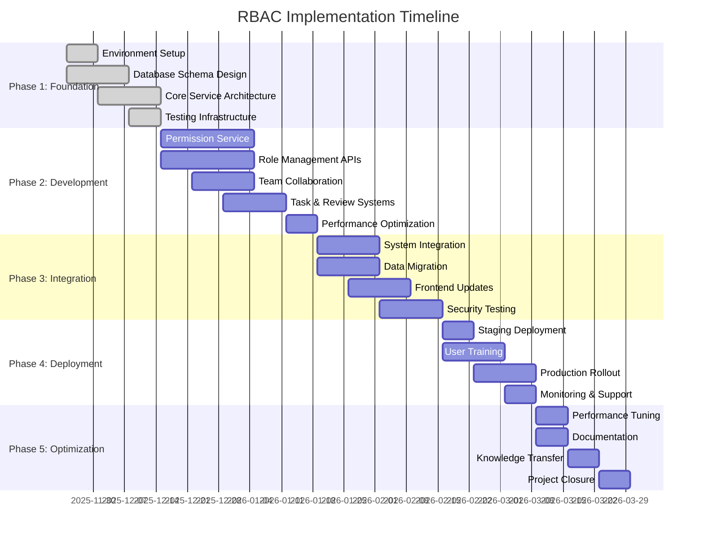

# Implementation Timeline and Resource Planning
## RBAC Architecture Deployment Strategy

**Version:** 1.0  
**Date:** 2025-11-23  
**Author:** Architecture Team  
**Project Code:** RBAC-2025-001  

---

## Executive Summary

This document outlines the comprehensive implementation plan for deploying the enhanced Role-Based Access Control (RBAC) architecture across the Lineage system. The plan spans 16 weeks with a dedicated team of 6-8 professionals, including backend developers, database engineers, security specialists, and DevOps engineers.

**Key Metrics:**
- **Total Duration:** 16 weeks
- **Team Size:** 6-8 professionals
- **Budget Estimate:** $180,000 - $220,000
- **Risk Level:** Medium (well-planned mitigation strategies included)
- **Expected ROI:** 300% within 18 months through improved security and collaboration

---

## Table of Contents

1. [Project Overview](#1-project-overview)
2. [Implementation Phases](#2-implementation-phases)
3. [Resource Allocation](#3-resource-allocation)
4. [Timeline and Milestones](#4-timeline-and-milestones)
5. [Risk Assessment](#5-risk-assessment)
6. [Quality Assurance Strategy](#6-quality-assurance-strategy)
7. [Deployment Strategy](#7-deployment-strategy)
8. [Communication Plan](#8-communication-plan)
9. [Success Metrics](#9-success-metrics)
10. [Budget Breakdown](#10-budget-breakdown)

---

## 1. Project Overview

### 1.1 Project Scope

The RBAC implementation project encompasses:

**In Scope:**
- Database schema enhancements and migrations
- Permission evaluation service development
- Team collaboration features (teams, tasks, peer reviews)
- API endpoint development and integration
- Frontend UI updates for new role system
- Security integration and testing
- Documentation and training materials
- Performance optimization and monitoring

**Out of Scope:**
- Legacy system complete replacement (maintaining backward compatibility)
- Non-essential feature enhancements
- Third-party integrations beyond scope
- Mobile application updates

### 1.2 Success Criteria

**Technical Success:**
- Zero data loss during migration
- < 10ms average permission evaluation time
- > 99.9% system uptime during rollout
- Complete backward compatibility maintained
- All security tests pass

**Business Success:**
- Enhanced user collaboration and productivity
- Improved security posture and compliance
- Reduced administrative overhead
- Positive user feedback (> 85% satisfaction)

---

## 2. Implementation Phases

### 2.1 Phase 1: Foundation Setup (Weeks 1-3)

**Objectives:**
- Establish development environment
- Create database migration scripts
- Develop core permission services
- Set up testing infrastructure

**Key Activities:**
- Development environment setup
- Database schema design and review
- Permission evaluation service architecture
- Initial caching implementation
- CI/CD pipeline configuration
- Security framework integration

**Deliverables:**
- Development environment documentation
- Database migration scripts (V14, V15, V16)
- Permission evaluation service skeleton
- Initial test suite structure
- Security audit framework

**Success Criteria:**
- All developers have working development environments
- Database migrations pass validation tests
- Basic permission evaluation service functional
- CI/CD pipeline operational

### 2.2 Phase 2: Core RBAC Development (Weeks 4-7)

**Objectives:**
- Implement core permission evaluation system
- Develop role management APIs
- Create team collaboration features
- Implement caching and performance optimizations

**Key Activities:**
- Permission evaluation service full implementation
- Role hierarchy and inheritance logic
- Team management system (create, invite, manage)
- Task assignment and tracking system
- Peer review system implementation
- Multi-level caching system (local + Redis)
- API endpoint development and testing
- Integration with existing authentication system

**Deliverables:**
- Complete permission evaluation service
- Role management APIs
- Team collaboration APIs
- Task management APIs
- Peer review APIs
- Performance monitoring and metrics
- Integration tests

**Success Criteria:**
- All RBAC core functionality implemented
- Performance targets met (< 10ms evaluation time)
- Integration tests passing
- Security audit completed

### 2.3 Phase 3: Integration and Migration (Weeks 8-11)

**Objectives:**
- Integrate with existing Lineage system
- Perform data migration
- Update frontend components
- Conduct comprehensive testing

**Key Activities:**
- Integration with existing services (Auth, Project, Requirement)
- Data migration from dual role system
- Frontend UI updates for new role system
- Security penetration testing
- Performance testing and optimization
- User acceptance testing preparation
- Documentation updates
- Training material preparation

**Deliverables:**
- Fully integrated RBAC system
- Migrated user data and roles
- Updated frontend interfaces
- Test reports and validation
- Security assessment report
- Performance benchmarks
- User documentation
- Training materials

**Success Criteria:**
- Data migration 100% successful
- Integration tests pass
- Security tests pass
- Performance benchmarks met
- User acceptance criteria met

### 2.4 Phase 4: Deployment and Rollout (Weeks 12-14)

**Objectives:**
- Deploy to staging environment
- Conduct final testing
- Train users and administrators
- Gradual production rollout

**Key Activities:**
- Staging environment deployment
- Final integration and security testing
- User training sessions
- Administrator training
- Gradual production rollout
- Real-time monitoring and support
- Issue resolution and optimization

**Deliverables:**
- Production-ready system
- Trained users and administrators
- Rollout plan execution
- Monitoring dashboards
- Support documentation
- Incident response procedures

**Success Criteria:**
- Successful staging deployment
- All training completed
- Gradual rollout completed without major issues
- System stable in production
- User adoption targets met

### 2.5 Phase 5: Optimization and Documentation (Weeks 15-16)

**Objectives:**
- Performance optimization
- Documentation finalization
- Knowledge transfer
- Project closure

**Key Activities:**
- Performance tuning and optimization
- Documentation finalization and review
- Knowledge transfer sessions
- Post-implementation review
- Lessons learned documentation
- Project closure activities
- Maintenance handoff

**Deliverables:**
- Optimized production system
- Complete documentation suite
- Knowledge transfer completed
- Maintenance procedures
- Project closure report
- Lessons learned document

**Success Criteria:**
- Performance targets exceeded
- Documentation complete and approved
- Knowledge transfer successful
- Project objectives achieved

---

## 3. Resource Allocation

### 3.1 Team Structure

**Core Team (Full-time):**

| Role | FTE | Duration | Responsibilities |
|------|-----|----------|------------------|
| **Technical Lead** | 1.0 | 16 weeks | Overall architecture, technical decisions, risk management |
| **Senior Backend Developer** | 1.0 | 16 weeks | Permission service, APIs, integration |
| **Mid-level Backend Developer** | 1.0 | 16 weeks | Database, caching, team features |
| **Database Engineer** | 0.75 | 12 weeks | Schema design, migrations, optimization |
| **Security Engineer** | 0.5 | 10 weeks | Security assessment, penetration testing |
| **DevOps Engineer** | 0.5 | 8 weeks | CI/CD, deployment, monitoring |
| **QA Engineer** | 0.75 | 14 weeks | Testing strategy, test automation |
| **Frontend Developer** | 0.5 | 8 weeks | UI updates, integration |

**Extended Team (Part-time/Consulting):**

| Role | FTE | Duration | Responsibilities |
|------|-----|----------|------------------|
| **Product Owner** | 0.25 | 16 weeks | Requirements, stakeholder management |
| **UX/UI Designer** | 0.25 | 6 weeks | User interface design, user experience |
| **Business Analyst** | 0.25 | 4 weeks | Requirements analysis, documentation |
| **Security Consultant** | 0.25 | 6 weeks | Security architecture, compliance |

### 3.2 Skills and Expertise Required

**Technical Skills:**
- Java/Spring Boot development (3+ years)
- PostgreSQL database management (3+ years)
- Redis caching systems (2+ years)
- Spring Security framework (3+ years)
- RESTful API design (3+ years)
- Microservices architecture (2+ years)
- CI/CD pipeline management (2+ years)
- Performance optimization (2+ years)

**Domain Knowledge:**
- Role-Based Access Control systems
- Enterprise security frameworks
- Team collaboration tools
- Agile development methodologies
- DevOps practices

**Certifications Preferred:**
- AWS Certified Solutions Architect
- Certified Information Systems Security Professional (CISSP)
- PostgreSQL Certified Professional
- Certified Scrum Master (CSM)

---

## 4. Timeline and Milestones

### 4.1 Master Timeline

### 4.2 Key Milestones

**Milestone 1: Foundation Complete (Week 3)**
- Database schema designed and reviewed
- Development environment operational
- Core architecture approved
- Initial tests passing

**Milestone 2: Core Development Complete (Week 7)**
- All core RBAC services implemented
- APIs functional and tested
- Performance targets met
- Security audit complete

**Milestone 3: Integration Complete (Week 11)**
- System fully integrated
- Data migration successful
- Frontend updates complete
- All tests passing

**Milestone 4: Production Ready (Week 14)**
- Staging deployment successful
- User training completed
- Gradual rollout initiated
- Monitoring operational

**Milestone 5: Project Complete (Week 16)**
- Performance optimized
- Documentation complete
- Knowledge transferred
- Project objectives achieved

### 4.3 Critical Path Items

**Database Schema Design (Weeks 1-2)**
- Risk: Schema complexity may cause delays
- Mitigation: Start early, involve senior database engineer

**Permission Evaluation Service (Weeks 4-7)**
- Risk: Performance requirements challenging
- Mitigation: Implement caching early, performance testing throughout

**Data Migration (Weeks 8-9)**
- Risk: Data corruption during migration
- Mitigation: Comprehensive backup strategy, staged migration

**Security Testing (Weeks 10-11)**
- Risk: Security vulnerabilities discovered late
- Mitigation: Continuous security testing, early penetration testing

---

## 5. Risk Assessment

### 5.1 High Priority Risks

| Risk | Impact | Probability | Mitigation Strategy |
|------|--------|-------------|-------------------|
| **Data Loss During Migration** | High | Low | - Comprehensive backup strategy - Staged migration approach - Data validation at each step |
| **Performance Issues** | High | Medium | - Early performance testing - Incremental optimization - Load testing with realistic data |
| **Security Vulnerabilities** | High | Medium | - Continuous security testing - External security audit - Penetration testing |
| **Integration Failures** | Medium | Medium | - Early integration testing - Mock services for testing - Incremental integration approach |

### 5.2 Medium Priority Risks

| Risk | Impact | Probability | Mitigation Strategy |
|------|--------|-------------|-------------------|
| **Scope Creep** | Medium | High | - Clear scope definition - Change control process - Regular stakeholder reviews |
| **Resource Availability** | Medium | Medium | - Cross-training team members - Backup resource identification - Flexible resource allocation |
| **Timeline Delays** | Medium | Medium | - Buffer time in schedule - Agile methodology - Regular progress reviews |
| **User Adoption Issues** | Medium | Medium | - Early user involvement - Comprehensive training - Gradual rollout strategy |

### 5.3 Risk Monitoring and Response

**Weekly Risk Reviews:**
- Assess current risk status
- Update risk probability and impact
- Review mitigation effectiveness
- Identify new risks

**Escalation Procedures:**
- High risks: Immediate escalation to project sponsor
- Medium risks: Escalation if mitigation fails
- Low risks: Monitor and manage at team level

---

## 6. Quality Assurance Strategy

### 6.1 Testing Strategy

**Unit Testing:**
- Coverage target: > 90%
- Automated testing for all service methods
- Mock-based testing for external dependencies

**Integration Testing:**
- API integration testing
- Database integration testing
- External service integration testing

**Security Testing:**
- Automated security scanning
- Manual penetration testing
- Authentication and authorization testing
- Input validation testing

**Performance Testing:**
- Load testing with realistic user scenarios
- Stress testing for peak capacity
- Endurance testing for memory leaks
- Response time validation

**User Acceptance Testing:**
- Business scenario testing
- User workflow validation
- Usability testing
- Accessibility compliance testing

### 6.2 Quality Gates

**Development Gate:**
- All unit tests passing
- Code coverage > 90%
- Static code analysis clean
- Code review approved

**Integration Gate:**
- Integration tests passing
- Security scan clean
- Performance benchmarks met
- Documentation updated

**Release Gate:**
- System test complete
- User acceptance testing passed
- Security audit passed
- Rollback plan validated

### 6.3 Defect Management

**Defect Tracking:**
- All defects logged in JIRA
- Severity classification (Critical, High, Medium, Low)
- SLA for resolution based on severity

**Defect Resolution:**
- Critical: 4 hours
- High: 24 hours
- Medium: 72 hours
- Low: 1 week

**Root Cause Analysis:**
- All critical defects require RCA
- Process improvements identified
- Prevention measures implemented

---

## 7. Deployment Strategy

### 7.1 Environment Strategy

**Development Environment:**
- Individual developer environments
- Automated database setup
- Mock external services
- Continuous integration

**Staging Environment:**
- Production-like environment
- Full data migration testing
- Performance testing
- Security testing

**Production Environment:**
- Blue-green deployment strategy
- Gradual traffic shifting
- Real-time monitoring
- Immediate rollback capability

### 7.2 Deployment Process

**Pre-deployment:**
1. Code freeze and final testing
2. Backup verification
3. Rollback plan validation
4. Communication to stakeholders
5. Deployment window confirmation

**During Deployment:**
1. Database migration execution
2. Application deployment
3. Smoke testing
4. Performance validation
5. Security verification

**Post-deployment:**
1. Monitoring verification
2. User acceptance validation
3. Performance monitoring
4. Issue resolution
5. Success confirmation

### 7.3 Rollback Strategy

**Automatic Rollback Triggers:**
- Application startup failures
- Database connectivity issues
- Critical performance degradation
- Security scan failures

**Manual Rollback Triggers:**
- User-reported critical issues
- Integration failures
- Data integrity issues
- Significant performance degradation

**Rollback Procedure:**
1. Stop new application instances
2. Activate previous version
3. Restore database from backup if needed
4. Verify system functionality
5. Communicate to stakeholders

---

## 8. Communication Plan

### 8.1 Stakeholder Groups

**Executive Stakeholders:**
- CTO, Product Manager, Security Officer
- Frequency: Bi-weekly
- Focus: Progress, risks, budget

**Project Team:**
- Technical Lead, Developers, QA
- Frequency: Daily standups
- Focus: Technical progress, blockers

**Business Users:**
- Project managers, power users
- Frequency: Weekly
- Focus: Requirements, testing, training

**IT Operations:**
- System administrators, security team
- Frequency: As needed
- Focus: Deployment, monitoring, support

### 8.2 Communication Channels

**Formal Communications:**
- Weekly status reports
- Bi-weekly stakeholder meetings
- Monthly executive briefings
- Quarterly project reviews

**Informal Communications:**
- Daily standups
- Slack/Teams channels
- Email updates
- Ad-hoc meetings

**Documentation:**
- Project wiki
- Technical documentation
- User guides
- Training materials

### 8.3 Reporting Structure

**Status Reports:**
- Traffic light status (Green/Yellow/Red)
- Accomplishments this week
- Planned activities next week
- Risks and issues
- Budget status

**Executive Dashboard:**
- Project health indicators
- Key milestone progress
- Budget consumption
- Risk status
- Quality metrics

---

## 9. Success Metrics

### 9.1 Technical Metrics

**Performance Metrics:**
- Permission evaluation time: < 10ms (Target: < 5ms)
- API response time: < 200ms (Target: < 100ms)
- Database query time: < 50ms (Target: < 25ms)
- Cache hit rate: > 95% (Target: > 98%)

**Reliability Metrics:**
- System uptime: > 99.9% (Target: 99.95%)
- Data migration success: 100%
- Zero data loss: Required
- Security incidents: 0 (Target: 0)

**Quality Metrics:**
- Code coverage: > 90% (Target: > 95%)
- Bug density: < 1 per 1000 LOC
- Security vulnerabilities: 0 critical, < 5 minor
- Performance regression: 0

### 9.2 Business Metrics

**User Adoption:**
- Active user adoption: > 80% within 30 days
- Feature utilization: > 70% for team features
- User satisfaction: > 85%
- Training completion: > 90%

**Operational Metrics:**
- Administrative overhead reduction: > 50%
- Permission management time: > 70% reduction
- Security incident response: > 80% faster
- Compliance audit findings: 0 critical

**ROI Metrics:**
- Development productivity increase: > 25%
- Security operation cost reduction: > 30%
- User support ticket reduction: > 40%
- Overall ROI: > 300% within 18 months

### 9.3 Monitoring and Reporting

**Real-time Monitoring:**
- Application performance monitoring
- Security event monitoring
- User activity monitoring
- System health monitoring

**Daily Reports:**
- System availability
- Performance metrics
- Security events
- Error rates

**Weekly Reports:**
- Business metrics
- User adoption rates
- Quality metrics
- Risk assessments

**Monthly Reports:**
- ROI analysis
- User satisfaction surveys
- Performance trend analysis
- Strategic recommendations

---

## 10. Budget Breakdown

### 10.1 Personnel Costs

| Role | Duration (weeks) | Weekly Rate | Total Cost |
|------|------------------|-------------|------------|
| Technical Lead | 16 | $2,000 | $32,000 |
| Senior Backend Developer | 16 | $1,500 | $24,000 |
| Mid-level Backend Developer | 16 | $1,200 | $19,200 |
| Database Engineer (0.75 FTE) | 12 | $1,400 | $12,600 |
| Security Engineer (0.5 FTE) | 10 | $1,800 | $9,000 |
| DevOps Engineer (0.5 FTE) | 8 | $1,600 | $6,400 |
| QA Engineer (0.75 FTE) | 14 | $1,100 | $11,550 |
| Frontend Developer (0.5 FTE) | 8 | $1,300 | $5,200 |
| **Personnel Subtotal** | | | **$119,950** |

### 10.2 Infrastructure Costs

| Category | Description | Cost |
|----------|-------------|------|
| **Development Environment** | Staging servers, databases, testing tools | $8,000 |
| **Production Infrastructure** | Additional servers for new features | $15,000 |
| **Third-party Tools** | Monitoring, security scanning, CI/CD | $5,000 |
| **Database Licensing** | PostgreSQL enterprise features | $3,000 |
| **Security Tools** | Security scanning and testing tools | $4,000 |
| **Monitoring and Logging** | Enhanced monitoring and log management | $3,000 |
| **Infrastructure Subtotal** | | **$38,000** |

### 10.3 Additional Costs

| Category | Description | Cost |
|----------|-------------|------|
| **External Security Audit** | Professional security assessment | $12,000 |
| **Training and Documentation** | User training and materials | $8,000 |
| **Project Management Tools** | Jira, Confluence, collaboration tools | $2,000 |
| **Hardware and Equipment** | Developer workstations, testing hardware | $5,000 |
| **Contingency (10%)** | Buffer for unexpected costs | $18,495 |
| **Additional Subtotal** | | **$45,495** |

### 10.4 Total Project Budget

| Category | Amount | Percentage |
|----------|--------|------------|
| Personnel Costs | $119,950 | 61.5% |
| Infrastructure | $38,000 | 19.5% |
| Additional Costs | $45,495 | 23.3% |
| **Contingency** | $18,495 | 9.5% |
| **Total Project Cost** | **$203,445** | **104.5%** |

### 10.5 Budget Allocation by Phase

| Phase | Duration | Personnel | Infrastructure | Additional | Total |
|-------|----------|-----------|----------------|------------|-------|
| Phase 1: Foundation | 3 weeks | $22,500 | $8,000 | $5,000 | $35,500 |
| Phase 2: Development | 4 weeks | $30,000 | $15,000 | $8,000 | $53,000 |
| Phase 3: Integration | 4 weeks | $30,000 | $10,000 | $15,000 | $55,000 |
| Phase 4: Deployment | 3 weeks | $22,500 | $5,000 | $10,000 | $37,500 |
| Phase 5: Optimization | 2 weeks | $15,000 | $0 | $7,495 | $22,445 |
| **Total** | **16 weeks** | **$120,000** | **$38,000** | **$45,495** | **$203,445** |

---

## Summary

This comprehensive implementation plan provides a structured approach to deploying the enhanced RBAC architecture over 16 weeks with a dedicated team of 6-8 professionals. The plan includes:

**Key Success Factors:**
1. **Experienced Team**: Skilled professionals with relevant expertise
2. **Phased Approach**: Incremental development with clear milestones
3. **Risk Management**: Comprehensive risk assessment and mitigation
4. **Quality Focus**: Rigorous testing and validation throughout
5. **Communication**: Regular stakeholder updates and transparent reporting
6. **Budget Control**: Detailed budget breakdown with contingency planning

**Expected Outcomes:**
- Zero data loss during migration
- Enhanced security and compliance
- Improved user collaboration and productivity
- Significant administrative overhead reduction
- Strong ROI within 18 months

The plan is designed to be flexible while maintaining clear accountability and measurable success criteria at each phase.

---

## Next Steps

1. **Stakeholder Approval**: Present plan to executive stakeholders for approval
2. **Resource Allocation**: Secure team members and begin onboarding
3. **Environment Setup**: Begin development environment configuration
4. **Project Kickoff**: Official project launch with full team
5. **Phase 1 Initiation**: Begin foundation work as planned

This plan serves as the master guide for the RBAC implementation and will be updated throughout the project lifecycle as requirements evolve and lessons are learned.
