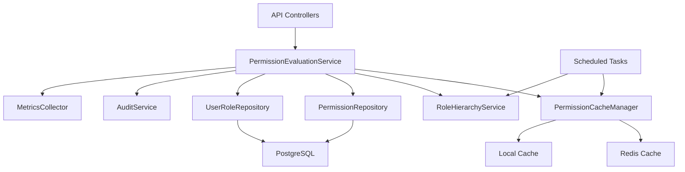
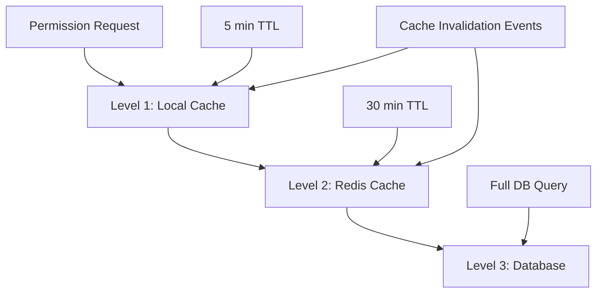

# Permission Evaluation Service Implementation
## Technical Design and Architecture

**Version:** 1.0  
**Date:** 2025-11-23  
**Author:** Architecture Team  

---

## Overview

The Permission Evaluation Service is the core component of the enhanced RBAC system, responsible for determining user permissions in real-time with high performance and reliability. This document outlines the complete implementation strategy, including interfaces, caching mechanisms, performance optimizations, and integration with the existing Lineage security framework.

---

## Table of Contents

1. [Service Architecture](#1-service-architecture)
2. [Core Interfaces](#2-core-interfaces)
3. [Implementation Classes](#3-implementation-classes)
4. [Caching Strategy](#4-caching-strategy)
5. [Performance Optimization](#5-performance-optimization)
6. [Integration with Spring Security](#6-integration-with-spring-security)
7. [Database Integration](#7-database-integration)
8. [Monitoring and Metrics](#8-monitoring-and-metrics)
9. [Testing Strategy](#9-testing-strategy)
10. [Configuration](#10-configuration)

---

## 1. Service Architecture

### 1.1 High-Level Architecture



### 1.2 Service Layer Design

The Permission Evaluation Service follows a layered architecture:

- **Facade Layer**: High-level API for external callers
- **Business Logic Layer**: Core permission evaluation algorithms
- **Data Access Layer**: Repository interactions with database
- **Caching Layer**: Multi-level caching for performance
- **Integration Layer**: Spring Security and JWT integration

---

## 2. Core Interfaces

### 2.1 Primary Service Interface

```java
/**
 * Central service for evaluating user permissions with caching and audit support
 */
public interface PermissionEvaluationService {
    
    /**
     * Check if user has specific permission
     */
    PermissionResult hasPermission(UUID userId, String permissionKey);
    
    /**
     * Check if user has permission for specific resource
     */
    PermissionResult hasPermission(UUID userId, String permissionKey, UUID resourceId);
    
    /**
     * Check if user has permission with context
     */
    PermissionResult hasPermission(UUID userId, String permissionKey, UUID resourceId, PermissionContext context);
    
    /**
     * Get all effective permissions for user
     */
    Set<String> getEffectivePermissions(UUID userId);
    
    /**
     * Get effective permissions for user scoped to resource
     */
    Set<String> getEffectivePermissions(UUID userId, UUID resourceId);
    
    /**
     * Get permissions grouped by resource
     */
    Map<UUID, Set<String>> getScopedPermissions(UUID userId);
    
    /**
     * Check role hierarchy level
     */
    boolean hasRoleOrHigher(UUID userId, RoleType minimumRole);
    
    /**
     * Get user's maximum role hierarchy level
     */
    int getUserMaxRoleLevel(UUID userId);
    
    /**
     * Batch permission evaluation
     */
    Map<String, PermissionResult> evaluateBatchPermissions(UUID userId, List<String> permissionKeys);
    
    /**
     * Evaluate permission with detailed context for debugging
     */
    DetailedPermissionResult evaluatePermission(UUID userId, String permissionKey, UUID resourceId, PermissionContext context);
}
```

### 2.2 Supporting Interfaces

```java
/**
 * Permission evaluation result with context
 */
public interface PermissionResult {
    boolean isAuthorized();
    String getReason();
    Set<String> getUserPermissions();
    Set<String> getRequiredPermissions();
    Set<String> getMissingPermissions();
    PermissionEvaluationContext getContext();
    long getEvaluationTimeMs();
}

/**
 * Detailed permission result for debugging and audit
 */
public interface DetailedPermissionResult extends PermissionResult {
    String getEvaluationPath();
    List<String> getCheckedRoles();
    Map<String, Boolean> getRoleHierarchyCheck();
    Set<String> getCachedPermissions();
    boolean isCacheHit();
}

/**
 * Context for permission evaluation
 */
public interface PermissionContext {
    UUID getProjectId();
    UUID getTeamId();
    String getAction();
    Map<String, Object> getCustomAttributes();
    boolean isOwnershipCheck();
    LocalDateTime getEvaluationTime();
}

/**
 * Cache management for permissions
 */
public interface PermissionCacheManager {
    
    /**
     * Get cached permissions for user
     */
    CachedUserPermissions getCachedPermissions(UUID userId);
    
    /**
     * Cache user permissions
     */
    void cachePermissions(UUID userId, CachedUserPermissions permissions, Duration ttl);
    
    /**
     * Invalidate user permission cache
     */
    void invalidateUserPermissions(UUID userId);
    
    /**
     * Invalidate all caches
     */
    void invalidateAllCaches();
    
    /**
     * Get cache statistics
     */
    CacheStatistics getCacheStatistics();
}
```

---

## 3. Implementation Classes

### 3.1 Main Service Implementation

```java
@Service
@Slf4j
@Transactional(readOnly = true)
public class PermissionEvaluationServiceImpl implements PermissionEvaluationService {
    
    private final PermissionRepository permissionRepository;
    private final UserRoleRepository userRoleRepository;
    private final RoleHierarchyService roleHierarchyService;
    private final PermissionCacheManager cacheManager;
    private final AuditService auditService;
    private final MetricsCollector metricsCollector;
    private final PermissionEvaluatorConfig config;
    
    // Cache configuration
    private static final Duration DEFAULT_CACHE_TTL = Duration.ofMinutes(15);
    private static final Duration LONG_CACHE_TTL = Duration.ofHours(1);
    
    @Autowired
    public PermissionEvaluationServiceImpl(
            PermissionRepository permissionRepository,
            UserRoleRepository userRoleRepository,
            RoleHierarchyService roleHierarchyService,
            PermissionCacheManager cacheManager,
            AuditService auditService,
            MetricsCollector metricsCollector,
            PermissionEvaluatorConfig config) {
        this.permissionRepository = permissionRepository;
        this.userRoleRepository = userRoleRepository;
        this.roleHierarchyService = roleHierarchyService;
        this.cacheManager = cacheManager;
        this.auditService = auditService;
        this.metricsCollector = metricsCollector;
        this.config = config;
    }
    
    @Override
    public PermissionResult hasPermission(UUID userId, String permissionKey) {
        return hasPermission(userId, permissionKey, null, createBasicContext());
    }
    
    @Override
    public PermissionResult hasPermission(UUID userId, String permissionKey, UUID resourceId) {
        return hasPermission(userId, permissionKey, resourceId, createResourceContext(resourceId));
    }
    
    @Override
    public PermissionResult hasPermission(UUID userId, String permissionKey, UUID resourceId, PermissionContext context) {
        StopWatch stopWatch = StopWatch.createStarted();
        
        try {
            log.debug("Evaluating permission {} for user {} with resource {}", 
                     permissionKey, userId, resourceId);
            
            // Check cache first
            CachedUserPermissions cachedPermissions = cacheManager.getCachedPermissions(userId);
            if (cachedPermissions != null && cachedPermissions.hasPermission(permissionKey, resourceId)) {
                log.debug("Permission {} found in cache for user {}", permissionKey, userId);
                metricsCollector.recordCacheHit(userId, permissionKey);
                return createResult(true, "cached", cachedPermissions.getEffectivePermissions(), 
                                  Set.of(permissionKey), Set.of(), context, stopWatch.getTime());
            }
            
            // Evaluate permission from database
            Set<String> userPermissions = evaluatePermissionsFromDB(userId, context);
            Set<String> requiredPermissions = Set.of(permissionKey);
            Set<String> missingPermissions = requiredPermissions.stream()
                    .filter(perm -> !userPermissions.contains(perm))
                    .collect(Collectors.toSet());
            
            boolean authorized = missingPermissions.isEmpty();
            String reason = authorized ? "authorized" : "insufficient_permissions";
            
            // Cache successful results
            if (authorized && config.isCacheSuccessfulEvaluations()) {
                cacheSuccessfulEvaluation(userId, permissionKey, resourceId, context);
            }
            
            // Audit the evaluation
            auditService.logPermissionEvaluation(userId, permissionKey, resourceId, 
                                               authorized, context);
            
            // Record metrics
            metricsCollector.recordPermissionEvaluation(userId, permissionKey, authorized, 
                                                       stopWatch.getTime(), false);
            
            return createResult(authorized, reason, userPermissions, requiredPermissions, 
                              missingPermissions, context, stopWatch.getTime());
                              
        } catch (Exception e) {
            log.error("Error evaluating permission {} for user {}", permissionKey, userId, e);
            metricsCollector.recordPermissionEvaluationError(userId, permissionKey, e);
            
            // Return denied on error for security
            return createResult(false, "evaluation_error", Set.of(), Set.of(permissionKey), 
                              Set.of(permissionKey), context, stopWatch.getTime());
        }
    }
    
    @Override
    public Set<String> getEffectivePermissions(UUID userId) {
        try {
            CachedUserPermissions cachedPermissions = cacheManager.getCachedPermissions(userId);
            if (cachedPermissions != null) {
                return cachedPermissions.getAllPermissions();
            }
            
            Set<String> permissions = evaluatePermissionsFromDB(userId, createBasicContext());
            
            // Cache the result
            cachePermissions(userId, permissions, DEFAULT_CACHE_TTL);
            
            return permissions;
        } catch (Exception e) {
            log.error("Error getting effective permissions for user {}", userId, e);
            return Set.of(); // Return empty set on error
        }
    }
    
    @Override
    public Set<String> getEffectivePermissions(UUID userId, UUID resourceId) {
        PermissionContext context = createResourceContext(resourceId);
        return getEffectivePermissions(userId, context);
    }
    
    @Override
    public Map<UUID, Set<String>> getScopedPermissions(UUID userId) {
        try {
            Set<UserRole> userRoles = userRoleRepository.findByUserIdAndIsActive(userId);
            
            return userRoles.stream()
                    .filter(role -> role.getProjectId() != null)
                    .collect(Collectors.groupingBy(
                            UserRole::getProjectId,
                            Collectors.flatMapping(role -> 
                                getEffectivePermissions(userId, role.getProjectId()).stream(),
                                Collectors.toSet())
                    ));
        } catch (Exception e) {
            log.error("Error getting scoped permissions for user {}", userId, e);
            return Map.of();
        }
    }
    
    @Override
    public boolean hasRoleOrHigher(UUID userId, RoleType minimumRole) {
        int userMaxLevel = getUserMaxRoleLevel(userId);
        int requiredLevel = minimumRole.getHierarchyLevel();
        return userMaxLevel >= requiredLevel;
    }
    
    @Override
    public int getUserMaxRoleLevel(UUID userId) {
        try {
            Integer maxLevel = userRoleRepository.findMaxHierarchyLevelByUserId(userId);
            return maxLevel != null ? maxLevel : 0;
        } catch (Exception e) {
            log.error("Error getting max role level for user {}", userId, e);
            return 0;
        }
    }
    
    @Override
    public Map<String, PermissionResult> evaluateBatchPermissions(UUID userId, List<String> permissionKeys) {
        return permissionKeys.parallelStream()
                .collect(Collectors.toMap(
                        Function.identity(),
                        key -> hasPermission(userId, key)
                ));
    }
    
    @Override
    public DetailedPermissionResult evaluatePermission(UUID userId, String permissionKey, 
                                                       UUID resourceId, PermissionContext context) {
        // Implementation with detailed debugging information
        DetailedPermissionResult result = (DetailedPermissionResult) hasPermission(userId, permissionKey, resourceId, context);
        
        // Add detailed context
        result.setEvaluationPath(buildEvaluationPath(userId, permissionKey, resourceId));
        result.setCheckedRoles(getCheckedRoles(userId, context));
        result.setRoleHierarchyCheck(checkRoleHierarchy(userId, context));
        result.setCachedPermissions(getCachedPermissions(userId));
        
        return result;
    }
    
    // Private helper methods
    
    private Set<String> evaluatePermissionsFromDB(UUID userId, PermissionContext context) {
        Set<UserRole> userRoles = userRoleRepository.findByUserIdAndIsActive(userId);
        
        Set<String> permissions = new HashSet<>();
        
        for (UserRole userRole : userRoles) {
            // Check if role is within scope
            if (isRoleInScope(userRole, context)) {
                permissions.addAll(userRole.getEffectivePermissions());
            }
        }
        
        return permissions;
    }
    
    private boolean isRoleInScope(UserRole userRole, PermissionContext context) {
        // Check project scope
        if (context.getProjectId() != null) {
            return context.getProjectId().equals(userRole.getProjectId());
        }
        
        // Check global scope
        return userRole.getScope() == RoleScope.GLOBAL;
    }
    
    private void cacheSuccessfulEvaluation(UUID userId, String permissionKey, 
                                         UUID resourceId, PermissionContext context) {
        // Implementation for caching successful evaluations
    }
    
    private PermissionResult createResult(boolean authorized, String reason, 
                                        Set<String> userPermissions,
                                        Set<String> requiredPermissions,
                                        Set<String> missingPermissions,
                                        PermissionContext context, long evaluationTime) {
        return PermissionResult.builder()
                .authorized(authorized)
                .reason(reason)
                .userPermissions(userPermissions)
                .requiredPermissions(requiredPermissions)
                .missingPermissions(missingPermissions)
                .context(context)
                .evaluationTimeMs(evaluationTime)
                .build();
    }
}
```

### 3.2 Cache Manager Implementation

```java
@Component
@Slf4j
public class PermissionCacheManagerImpl implements PermissionCacheManager {
    
    private final Cache<String, CachedUserPermissions> localCache;
    private final RedisTemplate<String, Object> redisTemplate;
    private final CacheStatistics statistics;
    
    // Cache configuration
    private static final String CACHE_PREFIX = "perm:user:";
    private static final Duration LOCAL_CACHE_TTL = Duration.ofMinutes(5);
    private static final Duration REDIS_CACHE_TTL = Duration.ofMinutes(30);
    
    public PermissionCacheManagerImpl(
            @Qualifier("permissionCache") Cache<String, CachedUserPermissions> localCache,
            RedisTemplate<String, Object> redisTemplate) {
        this.localCache = localCache;
        this.redisTemplate = redisTemplate;
        this.statistics = new CacheStatistics();
    }
    
    @Override
    public CachedUserPermissions getCachedPermissions(UUID userId) {
        String cacheKey = CACHE_PREFIX + userId;
        
        // Try local cache first
        CachedUserPermissions localResult = localCache.get(cacheKey);
        if (localResult != null) {
            statistics.recordLocalCacheHit();
            log.debug("Found permissions in local cache for user {}", userId);
            return localResult;
        }
        
        // Try Redis cache
        try {
            CachedUserPermissions redisResult = (CachedUserPermissions) redisTemplate.opsForValue().get(cacheKey);
            if (redisResult != null) {
                statistics.recordRedisCacheHit();
                log.debug("Found permissions in Redis cache for user {}", userId);
                
                // Populate local cache
                localCache.put(cacheKey, redisResult);
                return redisResult;
            }
        } catch (Exception e) {
            log.warn("Error reading from Redis cache for user {}", userId, e);
            statistics.recordRedisError();
        }
        
        statistics.recordCacheMiss();
        return null;
    }
    
    @Override
    public void cachePermissions(UUID userId, CachedUserPermissions permissions, Duration ttl) {
        String cacheKey = CACHE_PREFIX + userId;
        
        // Cache in local cache
        localCache.put(cacheKey, permissions);
        statistics.recordLocalCachePut();
        
        // Cache in Redis
        try {
            redisTemplate.opsForValue().set(cacheKey, permissions, ttl);
            statistics.recordRedisCachePut();
        } catch (Exception e) {
            log.warn("Error caching permissions in Redis for user {}", userId, e);
            statistics.recordRedisError();
        }
    }
    
    @Override
    public void invalidateUserPermissions(UUID userId) {
        String cacheKey = CACHE_PREFIX + userId;
        
        // Remove from local cache
        localCache.evictIfPresent(cacheKey);
        statistics.recordLocalCacheEviction();
        
        // Remove from Redis
        try {
            redisTemplate.delete(cacheKey);
            statistics.recordRedisCacheEviction();
        } catch (Exception e) {
            log.warn("Error invalidating Redis cache for user {}", userId, e);
            statistics.recordRedisError();
        }
        
        log.debug("Invalidated permission cache for user {}", userId);
    }
    
    @Override
    public void invalidateAllCaches() {
        localCache.invalidate();
        try {
            Set<String> keys = redisTemplate.keys(CACHE_PREFIX + "*");
            if (!keys.isEmpty()) {
                redisTemplate.delete(keys);
                statistics.recordRedisCacheEviction(keys.size());
            }
        } catch (Exception e) {
            log.warn("Error invalidating Redis cache", e);
            statistics.recordRedisError();
        }
        
        log.info("Invalidated all permission caches");
    }
    
    @Override
    public CacheStatistics getCacheStatistics() {
        return statistics.snapshot();
    }
    
    /**
     * Scheduled cache cleanup
     */
    @Scheduled(fixedRate = 300000) // 5 minutes
    public void performCacheCleanup() {
        log.debug("Performing scheduled cache cleanup");
        statistics.reset();
    }
}
```

---

## 4. Caching Strategy

### 4.1 Multi-Level Caching Architecture

The permission evaluation service implements a sophisticated multi-level caching strategy:



### 4.2 Cache Implementation

```java
@Configuration
@EnableCaching
public class PermissionCacheConfig {
    
    @Bean
    @Qualifier("permissionCache")
    public Cache<String, CachedUserPermissions> permissionCache() {
        CaffeineCacheBuilder<String, CachedUserPermissions> builder = 
            CaffeineCacheBuilder.newBuilder()
                .maximumSize(10000)
                .expireAfterWrite(Duration.ofMinutes(5))
                .expireAfterAccess(Duration.ofMinutes(10))
                .recordStats()
                .removalListener((key, value, cause) -> {
                    log.debug("Removed permission cache entry: {} due to {}", key, cause);
                });
        
        return builder.build();
    }
    
    @Bean
    public CacheManager cacheManager() {
        CaffeineCacheManager cacheManager = new CaffeineCacheManager("permissionCache");
        cacheManager.setCaffeine(caffeineCacheBuilder());
        return cacheManager;
    }
    
    private Caffeine<Object, Object> caffeineCacheBuilder() {
        return Caffeine.newBuilder()
                .maximumSize(10000)
                .expireAfterWrite(Duration.ofMinutes(5))
                .expireAfterAccess(Duration.ofMinutes(10))
                .recordStats();
    }
}
```

### 4.3 Cache Invalidation Strategy

```java
@Component
public class PermissionCacheInvalidationService {
    
    private final PermissionCacheManager cacheManager;
    private final ApplicationEventPublisher eventPublisher;
    
    @EventListener
    public void handleRoleChange(RoleChangedEvent event) {
        log.info("Invalidating permission cache due to role change for user {}", event.getUserId());
        cacheManager.invalidateUserPermissions(event.getUserId());
        
        // Also invalidate team member caches if affected
        if (event.getTeamId() != null) {
            invalidateTeamMemberCaches(event.getTeamId());
        }
    }
    
    @EventListener
    public void handlePermissionChange(PermissionChangedEvent event) {
        log.info("Invalidating permission cache due to permission change for user {}", event.getUserId());
        cacheManager.invalidateUserPermissions(event.getUserId());
    }
    
    @TransactionalEventListener
    public void handleUserStatusChange(UserStatusChangedEvent event) {
        if (event.getNewStatus() == UserStatus.DEACTIVATED) {
            cacheManager.invalidateUserPermissions(event.getUserId());
        }
    }
    
    private void invalidateTeamMemberCaches(UUID teamId) {
        // Find all team members and invalidate their caches
        List<UUID> teamMemberIds = teamMemberRepository.findUserIdsByTeamId(teamId);
        teamMemberIds.forEach(cacheManager::invalidateUserPermissions);
    }
}
```

---

## 5. Performance Optimization

### 5.1 Database Query Optimization

```java
@Repository
public interface PermissionEvaluationRepository {
    
    /**
     * Optimized query to get user's effective permissions
     */
    @Query(value = """
        SELECT DISTINCT pd.permission_key
        FROM user_roles ur
        JOIN roles r ON ur.role_id = r.id
        JOIN roles_permissions rp ON r.id = rp.role_id  
        JOIN permission_definitions pd ON rp.permission_id = pd.id
        WHERE ur.user_id = :userId
          AND ur.is_active = true
          AND (ur.effective_until IS NULL OR ur.effective_until > NOW())
          AND (r.is_active = true)
          AND (ur.project_id = :projectId OR ur.scope = 'GLOBAL')
        """, nativeQuery = true)
    Set<String> findEffectivePermissionsByUserAndProject(
            @Param("userId") UUID userId, 
            @Param("projectId") UUID projectId);
    
    /**
     * Get user's maximum role hierarchy level
     */
    @Query("SELECT MAX(r.hierarchyLevel) FROM UserRole ur JOIN ur.role r WHERE ur.userId = :userId AND ur.isActive = true")
    Integer findMaxHierarchyLevelByUserId(@Param("userId") UUID userId);
    
    /**
     * Batch permission evaluation for multiple users
     */
    @Query(value = """
        SELECT ur.user_id, pd.permission_key
        FROM user_roles ur
        JOIN roles r ON ur.role_id = r.id
        JOIN roles_permissions rp ON r.id = rp.role_id
        JOIN permission_definitions pd ON rp.permission_id = pd.id
        WHERE ur.user_id IN (:userIds)
          AND ur.is_active = true
          AND (ur.effective_until IS NULL OR ur.effective_until > NOW())
          AND pd.permission_key IN (:permissionKeys)
        """, nativeQuery = true)
    List<Object[]> findBatchPermissions(
            @Param("userIds") List<UUID> userIds, 
            @Param("permissionKeys") List<String> permissionKeys);
}
```

### 5.2 Async Processing

```java
@Service
@Slf4j
public class AsyncPermissionEvaluator {
    
    @Async("permissionEvaluationExecutor")
    public CompletableFuture<PermissionResult> evaluatePermissionAsync(
            UUID userId, String permissionKey, UUID resourceId, PermissionContext context) {
        
        return CompletableFuture.supplyAsync(() -> {
            try {
                return permissionEvaluationService.hasPermission(userId, permissionKey, resourceId, context);
            } catch (Exception e) {
                log.error("Error in async permission evaluation", e);
                return PermissionResult.denied("async_evaluation_error");
            }
        });
    }
    
    @Async("permissionEvaluationExecutor")
    public CompletableFuture<Map<String, PermissionResult>> evaluateBatchPermissionsAsync(
            UUID userId, List<String> permissionKeys) {
        
        return CompletableFuture.supplyAsync(() -> {
            try {
                return permissionEvaluationService.evaluateBatchPermissions(userId, permissionKeys);
            } catch (Exception e) {
                log.error("Error in async batch permission evaluation", e);
                return permissionKeys.stream()
                    .collect(Collectors.toMap(
                        Function.identity(),
                        key -> PermissionResult.denied("async_batch_evaluation_error")
                    ));
            }
        });
    }
}
```

### 5.3 Connection Pooling

```java
@Configuration
public class DatabaseConfig {
    
    @Bean
    @Primary
    @ConfigurationProperties("spring.datasource.hikari")
    public HikariConfig primaryDataSourceProperties() {
        HikariConfig config = new HikariConfig();
        config.setMaximumPoolSize(20);
        config.setMinimumIdle(5);
        config.setConnectionTimeout(30000);
        config.setIdleTimeout(600000);
        config.setMaxLifetime(1800000);
        config.setLeakDetectionThreshold(60000);
        return config;
    }
    
    @Bean
    @Qualifier("permissionEvaluationExecutor")
    public Executor permissionEvaluationExecutor() {
        ThreadPoolTaskExecutor executor = new ThreadPoolTaskExecutor();
        executor.setCorePoolSize(5);
        executor.setMaxPoolSize(20);
        executor.setQueueCapacity(100);
        executor.setThreadNamePrefix("PermissionEval-");
        executor.setRejectedExecutionHandler(new ThreadPoolExecutor.CallerRunsPolicy());
        executor.initialize();
        return executor;
    }
}
```

---

## 6. Integration with Spring Security

### 6.1 Custom PermissionEvaluator

```java
@Component
public class LineagePermissionEvaluator implements PermissionEvaluator {
    
    private final PermissionEvaluationService permissionService;
    private final PermissionContextBuilder contextBuilder;
    
    @Autowired
    public LineagePermissionEvaluator(
            PermissionEvaluationService permissionService,
            PermissionContextBuilder contextBuilder) {
        this.permissionService = permissionService;
        this.contextBuilder = contextBuilder;
    }
    
    @Override
    public boolean hasPermission(Authentication authentication, Object targetDomainObject, Object permission) {
        if (authentication == null || !authentication.isAuthenticated()) {
            return false;
        }
        
        UUID userId = getUserIdFromAuthentication(authentication);
        String permissionKey = permission.toString();
        UUID resourceId = extractResourceId(targetDomainObject);
        PermissionContext context = contextBuilder.buildContext(targetDomainObject);
        
        PermissionResult result = permissionService.hasPermission(userId, permissionKey, resourceId, context);
        return result.isAuthorized();
    }
    
    @Override
    public boolean hasPermission(Authentication authentication, Serializable targetId, String targetType, Object permission) {
        if (authentication == null || !authentication.isAuthenticated()) {
            return false;
        }
        
        UUID userId = getUserIdFromAuthentication(authentication);
        String permissionKey = permission.toString();
        UUID resourceId = createResourceId(targetId, targetType);
        PermissionContext context = contextBuilder.buildContext(targetId, targetType);
        
        PermissionResult result = permissionService.hasPermission(userId, permissionKey, resourceId, context);
        return result.isAuthorized();
    }
    
    private UUID getUserIdFromAuthentication(Authentication authentication) {
        UserPrincipal principal = (UserPrincipal) authentication.getPrincipal();
        return principal.getUserId();
    }
    
    private UUID extractResourceId(Object targetDomainObject) {
        if (targetDomainObject instanceof Project) {
            return ((Project) targetDomainObject).getId();
        } else if (targetDomainObject instanceof Requirement) {
            return ((Requirement) targetDomainObject).getProject().getId();
        } else if (targetDomainObject instanceof UUID) {
            return (UUID) targetDomainObject;
        }
        return null;
    }
    
    private UUID createResourceId(Serializable targetId, String targetType) {
        if ("project".equalsIgnoreCase(targetType) || "Project".equals(targetType)) {
            return UUID.fromString(targetId.toString());
        }
        return null;
    }
}
```

### 6.2 Security Method Annotations

```java
/**
 * Custom permission annotation for method-level security
 */
@Target({ElementType.METHOD, ElementType.TYPE})
@Retention(RetentionPolicy.RUNTIME)
@PreAuthorize("hasPermission(#resourceId, 'project', 'project.delete')")
public @interface RequireProjectPermission {
    String value();
    String resourceId() default "";
    boolean requireConfirmation() default false;
}

/**
 * Role-based annotation
 */
@Target({ElementType.METHOD, ElementType.TYPE})
@Retention(RetentionPolicy.RUNTIME)
@PreAuthorize("hasRoleOrHigher('ADMINISTRATOR')")
public @interface RequireAdministratorRole {
}

/**
 * Combined permission and role annotation
 */
@Target({ElementType.METHOD, ElementType.TYPE})
@Retention(RetentionPolicy.RUNTIME)
@PreAuthorize("hasRoleOrHigher('ADMINISTRATOR') and hasPermission(#projectId, 'project', 'project.manage')")
public @interface RequireProjectManagement {
    UUID projectId() default UUID.randomUUID();
}
```

---

## 7. Database Integration

### 7.1 JPA Entities

```java
@Entity
@Table(name = "permission_definitions")
public class PermissionDefinition {
    
    @Id
    @GeneratedValue
    private UUID id;
    
    @Column(unique = true, nullable = false)
    private String permissionKey;
    
    @Column(nullable = false)
    private String resource;
    
    @Column(nullable = false)
    private String action;
    
    @Column(length = 1000)
    private String description;
    
    private String category;
    
    private boolean requiresConfirmation;
    private boolean auditRequired;
    private boolean isSystem;
    
    @Enumerated(EnumType.STRING)
    private RiskLevel riskLevel;
    
    @CreationTimestamp
    private LocalDateTime createdAt;
    
    @UpdateTimestamp
    private LocalDateTime updatedAt;
    
    // Getters and setters
}

@Entity
@Table(name = "user_roles")
public class UserRole {
    
    @Id
    @GeneratedValue
    private UUID id;
    
    @ManyToOne(fetch = FetchType.LAZY)
    @JoinColumn(name = "user_id", nullable = false)
    private User user;
    
    @ManyToOne(fetch = FetchType.LAZY)
    @JoinColumn(name = "role_id", nullable = false)
    private Role role;
    
    @Column(name = "project_id")
    private UUID projectId;
    
    @Enumerated(EnumType.STRING)
    private RoleScope scope;
    
    @ManyToOne(fetch = FetchType.LAZY)
    @JoinColumn(name = "granted_by")
    private User grantedBy;
    
    private LocalDateTime grantedAt;
    private LocalDateTime expiresAt;
    private boolean isActive;
    
    @Convert(converter = JsonbConverter.class)
    private Map<String, Object> resourceScopes;
    
    @Convert(converter = JsonbConverter.class)
    private Map<String, Object> conditionalPermissions;
    
    @CreationTimestamp
    private LocalDateTime createdAt;
}
```

### 7.2 Repository Implementations

```java
@Repository
public class PermissionEvaluationRepositoryImpl implements PermissionEvaluationRepositoryCustom {
    
    private final EntityManager entityManager;
    
    @Autowired
    public PermissionEvaluationRepositoryImpl(EntityManager entityManager) {
        this.entityManager = entityManager;
    }
    
    @Override
    public Set<String> findEffectivePermissionsByUserAndProject(UUID userId, UUID projectId) {
        String jpql = """
            SELECT DISTINCT pd.permissionKey
            FROM UserRole ur
            JOIN ur.role r
            JOIN r.permissions pd
            WHERE ur.user.id = :userId
              AND ur.isActive = true
              AND (ur.expiresAt IS NULL OR ur.expiresAt > CURRENT_TIMESTAMP)
              AND (r.isActive = true)
              AND (ur.projectId = :projectId OR ur.scope = 'GLOBAL')
            """;
        
        TypedQuery<String> query = entityManager.createQuery(jpql, String.class);
        query.setParameter("userId", userId);
        query.setParameter("projectId", projectId);
        
        return new HashSet<>(query.getResultList());
    }
    
    @Override
    public Map<UUID, Set<String>> findScopedPermissions(UUID userId) {
        String jpql = """
            SELECT ur.projectId, pd.permissionKey
            FROM UserRole ur
            JOIN ur.role r
            JOIN r.permissions pd
            WHERE ur.user.id = :userId
              AND ur.isActive = true
              AND ur.projectId IS NOT NULL
              AND (ur.expiresAt IS NULL OR ur.expiresAt > CURRENT_TIMESTAMP)
              AND (r.isActive = true)
            """;
        
        TypedQuery<Object[]> query = entityManager.createQuery(jpql, Object[].class);
        query.setParameter("userId", userId);
        
        List<Object[]> results = query.getResultList();
        
        return results.stream()
                .collect(Collectors.groupingBy(
                        result -> (UUID) result[0],
                        Collectors.mapping(result -> (String) result[1], Collectors.toSet())
                ));
    }
}
```

---

## 8. Monitoring and Metrics

### 8.1 Metrics Collection

```java
@Component
@Slf4j
public class PermissionMetricsCollector {
    
    private final MeterRegistry meterRegistry;
    private final Timer permissionEvaluationTimer;
    private final Counter permissionEvaluationCounter;
    private final Counter cacheHitCounter;
    private final Counter cacheMissCounter;
    private final DistributionSummary evaluationLatency;
    
    @Autowired
    public PermissionMetricsCollector(MeterRegistry meterRegistry) {
        this.meterRegistry = meterRegistry;
        this.permissionEvaluationTimer = Timer.builder("permission.evaluations")
                .description("Permission evaluation timing")
                .register(meterRegistry);
        
        this.permissionEvaluationCounter = Counter.builder("permission.evaluations.total")
                .description("Total permission evaluations")
                .register(meterRegistry);
        
        this.cacheHitCounter = Counter.builder("permission.cache.hits")
                .description("Permission cache hits")
                .register(meterRegistry);
        
        this.cacheMissCounter = Counter.builder("permission.cache.misses")
                .description("Permission cache misses")
                .register(meterRegistry);
                
        this.evaluationLatency = DistributionSummary.builder("permission.evaluation.latency")
                .description("Permission evaluation latency in milliseconds")
                .register(meterRegistry);
    }
    
    public void recordPermissionEvaluation(UUID userId, String permissionKey, boolean authorized, 
                                         long durationMs, boolean cacheHit) {
        permissionEvaluationCounter
                .tag("authorized", String.valueOf(authorized))
                .tag("permission_key", permissionKey)
                .tag("cache_hit", String.valueOf(cacheHit))
                .increment();
        
        permissionEvaluationTimer.record(durationMs, TimeUnit.MILLISECONDS);
        evaluationLatency.record(durationMs);
        
        if (cacheHit) {
            cacheHitCounter.increment();
        } else {
            cacheMissCounter.increment();
        }
    }
    
    public void recordCacheOperation(String operation, String cacheLevel, boolean success) {
        Counter.builder("permission.cache.operations")
                .tag("operation", operation)
                .tag("cache_level", cacheLevel)
                .tag("success", String.valueOf(success))
                .register(meterRegistry)
                .increment();
    }
    
    public void recordDatabaseQuery(String queryType, long durationMs) {
        Timer.builder("permission.database.queries")
                .tag("query_type", queryType)
                .description("Database query timing")
                .register(meterRegistry)
                .record(durationMs, TimeUnit.MILLISECONDS);
    }
}
```

### 8.2 Health Checks

```java
@Component
public class PermissionServiceHealthIndicator implements HealthIndicator {
    
    private final PermissionEvaluationService permissionService;
    private final PermissionCacheManager cacheManager;
    
    @Autowired
    public PermissionServiceHealthIndicator(
            PermissionEvaluationService permissionService,
            PermissionCacheManager cacheManager) {
        this.permissionService = permissionService;
        this.cacheManager = cacheManager;
    }
    
    @Override
    public Health health() {
        try {
            // Test permission evaluation
            UUID testUserId = UUID.randomUUID();
            PermissionResult result = permissionService.hasPermission(testUserId, "system.health.check");
            
            // Test cache functionality
            CacheStatistics cacheStats = cacheManager.getCacheStatistics();
            
            Health.Builder builder = Health.up()
                    .withDetail("permission_evaluation", "working")
                    .withDetail("cache_operations", cacheStats.getTotalOperations())
                    .withDetail("cache_hit_rate", cacheStats.getHitRate() + "%");
            
            if (cacheStats.getHitRate() < 50.0) {
                builder.withDetail("warning", "Low cache hit rate detected");
            }
            
            return builder.build();
            
        } catch (Exception e) {
            return Health.down()
                    .withDetail("error", e.getClass().getSimpleName())
                    .withDetail("message", e.getMessage())
                    .build();
        }
    }
}
```

---

## 9. Testing Strategy

### 9.1 Unit Tests

```java
@ExtendWith(MockitoExtension.class)
class PermissionEvaluationServiceTest {
    
    @Mock
    private PermissionRepository permissionRepository;
    
    @Mock
    private UserRoleRepository userRoleRepository;
    
    @Mock
    private RoleHierarchyService roleHierarchyService;
    
    @Mock
    private PermissionCacheManager cacheManager;
    
    @Mock
    private AuditService auditService;
    
    @InjectMocks
    private PermissionEvaluationServiceImpl permissionService;
    
    @Test
    void shouldGrantPermissionWhenUserHasRequiredRole() {
        // Given
        UUID userId = UUID.randomUUID();
        String permissionKey = "project.create";
        
        when(cacheManager.getCachedPermissions(userId)).thenReturn(null);
        when(userRoleRepository.findByUserIdAndIsActive(userId))
            .thenReturn(createUserRolesWithPermission(permissionKey));
        
        // When
        PermissionResult result = permissionService.hasPermission(userId, permissionKey);
        
        // Then
        assertThat(result.isAuthorized()).isTrue();
        assertThat(result.getReason()).isEqualTo("authorized");
        verify(auditService).logPermissionEvaluation(eq(userId), eq(permissionKey), isNull(), eq(true), any());
    }
    
    @Test
    void shouldDenyPermissionWhenUserLacksRequiredRole() {
        // Given
        UUID userId = UUID.randomUUID();
        String permissionKey = "project.delete";
        
        when(cacheManager.getCachedPermissions(userId)).thenReturn(null);
        when(userRoleRepository.findByUserIdAndIsActive(userId))
            .thenReturn(createUserRolesWithoutPermission(permissionKey));
        
        // When
        PermissionResult result = permissionService.hasPermission(userId, permissionKey);
        
        // Then
        assertThat(result.isAuthorized()).isFalse();
        assertThat(result.getReason()).isEqualTo("insufficient_permissions");
        assertThat(result.getMissingPermissions()).containsExactly(permissionKey);
    }
    
    @Test
    void shouldReturnCachedPermissionsWhenAvailable() {
        // Given
        UUID userId = UUID.randomUUID();
        String permissionKey = "project.read";
        CachedUserPermissions cachedPermissions = createCachedPermissions(permissionKey);
        
        when(cacheManager.getCachedPermissions(userId)).thenReturn(cachedPermissions);
        
        // When
        PermissionResult result = permissionService.hasPermission(userId, permissionKey);
        
        // Then
        assertThat(result.isAuthorized()).isTrue();
        verify(cacheManager).getCachedPermissions(userId);
        verifyNoInteractions(userRoleRepository);
    }
    
    @Test
    void shouldHandleDatabaseErrorsGracefully() {
        // Given
        UUID userId = UUID.randomUUID();
        String permissionKey = "project.create";
        
        when(cacheManager.getCachedPermissions(userId)).thenReturn(null);
        when(userRoleRepository.findByUserIdAndIsActive(userId))
            .thenThrow(new DataAccessException("Database connection failed") {});
        
        // When
        PermissionResult result = permissionService.hasPermission(userId, permissionKey);
        
        // Then
        assertThat(result.isAuthorized()).isFalse();
        assertThat(result.getReason()).isEqualTo("evaluation_error");
    }
    
    private Set<UserRole> createUserRolesWithPermission(String permissionKey) {
        Role role = Role.builder()
                .hierarchyLevel(2)
                .permissions(Set.of(permissionKey))
                .build();
        
        UserRole userRole = UserRole.builder()
                .user(createUser(userId))
                .role(role)
                .scope(RoleScope.GLOBAL)
                .isActive(true)
                .build();
        
        return Set.of(userRole);
    }
}
```

### 9.2 Integration Tests

```java
@SpringBootTest
@TestMethodOrder(OrderAnnotation.class)
class PermissionEvaluationIntegrationTest {
    
    @Autowired
    private PermissionEvaluationService permissionService;
    
    @Autowired
    private UserRepository userRepository;
    
    @Autowired
    private RoleRepository roleRepository;
    
    @Autowired
    private DatabaseCleaner databaseCleaner;
    
    private static UUID testUserId;
    private static UUID testProjectId;
    
    @BeforeEach
    void setUp() {
        databaseCleaner.clean();
        testUserId = createTestUser();
        testProjectId = createTestProject();
    }
    
    @Test
    @Order(1)
    void shouldEvaluatePermissionsCorrectly() {
        // Test permission evaluation
        PermissionResult result = permissionService.hasPermission(testUserId, "project.read");
        assertThat(result.isAuthorized()).isTrue();
    }
    
    @Test
    @Order(2)
    void shouldCachePermissions() {
        // First call should hit database
        permissionService.hasPermission(testUserId, "project.read");
        
        // Second call should hit cache
        PermissionResult cachedResult = permissionService.hasPermission(testUserId, "project.read");
        assertThat(cachedResult.isAuthorized()).isTrue();
        
        // Verify cache was used (in real scenario, check metrics)
    }
    
    @Test
    @Order(3)
    void shouldInvalidateCacheOnRoleChange() {
        // Cache initial permissions
        permissionService.getEffectivePermissions(testUserId);
        
        // Change user role
        updateUserRole(testUserId, RoleType.USER);
        
        // Verify cache is invalidated
        Set<String> newPermissions = permissionService.getEffectivePermissions(testUserId);
        assertThat(newPermissions).doesNotContain("admin.delete");
    }
}
```

### 9.3 Performance Tests

```java
@SpringBootTest
class PermissionEvaluationPerformanceTest {
    
    @Autowired
    private PermissionEvaluationService permissionService;
    
    @Autowired
    private PerformanceTestHelper testHelper;
    
    @Test
    void shouldHandleHighVolumePermissionChecks() {
        // Setup test data
        int userCount = 1000;
        int permissionChecksPerUser = 100;
        
        List<UUID> testUsers = testHelper.createTestUsers(userCount);
        List<String> testPermissions = List.of("project.read", "project.create", "user.read");
        
        // Performance test
        StopWatch stopWatch = StopWatch.createStarted();
        
        testUsers.parallelStream().forEach(userId -> {
            testPermissions.parallelStream().forEach(permission -> {
                for (int i = 0; i < permissionChecksPerUser; i++) {
                    permissionService.hasPermission(userId, permission);
                }
            });
        });
        
        stopWatch.stop();
        
        long totalChecks = (long) userCount * permissionChecksPerUser * testPermissions.size();
        long averageTimePerCheck = stopWatch.getTime() / totalChecks;
        
        // Assert performance requirements
        assertThat(averageTimePerCheck).isLessThan(10); // Less than 10ms per check
        log.info("Performance test completed: {} checks in {}ms ({}ms avg)", 
                totalChecks, stopWatch.getTime(), averageTimePerCheck);
    }
}
```

---

## 10. Configuration

### 10.1 Application Configuration

```yaml
# application.yml
lineage:
  permission:
    evaluation:
      # Cache configuration
      cache:
        enabled: true
        local:
          ttl: 5m
          max-size: 10000
        redis:
          ttl: 30m
          key-prefix: "perm:user:"
      
      # Performance settings
      performance:
        async-enabled: true
        batch-size: 100
        timeout: 5s
      
      # Security settings
      security:
        cache-successful-evaluations: true
        audit-evaluations: true
        detailed-audit-for-admin: true
      
      # Database optimization
      database:
        query-timeout: 3s
        connection-pool-size: 20
        enable-query-caching: true

# Spring Cache configuration
spring:
  cache:
    type: caffeine
    cache-names:
      - permissionCache
    caffeine:
      spec: "maximumSize=10000,expireAfterWrite=5m,expireAfterAccess=10m"

# Redis configuration  
spring:
  redis:
    timeout: 2000ms
    lettuce:
      pool:
        max-active: 20
        max-idle: 10
        min-idle: 5
        max-wait: 2000ms
```

### 10.2 Configuration Properties

```java
@ConfigurationProperties(prefix = "lineage.permission.evaluation")
@ConstructorBinding
public class PermissionEvaluatorConfig {
    
    private final CacheConfig cache;
    private final PerformanceConfig performance;
    private final SecurityConfig security;
    private final DatabaseConfig database;
    
    public PermissionEvaluatorConfig(CacheConfig cache, PerformanceConfig performance,
                                   SecurityConfig security, DatabaseConfig database) {
        this.cache = cache;
        this.performance = performance;
        this.security = security;
        this.database = database;
    }
    
    // Getters
    public CacheConfig getCache() { return cache; }
    public PerformanceConfig getPerformance() { return performance; }
    public SecurityConfig getSecurity() { return security; }
    public DatabaseConfig getDatabase() { return database; }
    
    // Inner configuration classes
    public static class CacheConfig {
        private final boolean enabled;
        private final Duration localTtl;
        private final int localMaxSize;
        private final Duration redisTtl;
        private final String keyPrefix;
        
        // Constructor and getters
    }
    
    public static class PerformanceConfig {
        private final boolean asyncEnabled;
        private final int batchSize;
        private final Duration timeout;
        
        // Constructor and getters
    }
    
    public static class SecurityConfig {
        private final boolean cacheSuccessfulEvaluations;
        private final boolean auditEvaluations;
        private final boolean detailedAuditForAdmin;
        
        // Constructor and getters
    }
}
```

---

## Summary

This implementation provides a comprehensive, high-performance permission evaluation service that:

1. **Multi-level caching** for optimal performance
2. **Spring Security integration** with custom evaluators and annotations
3. **Comprehensive monitoring** and metrics collection
4. **Robust error handling** and graceful degradation
5. **Extensive testing** including unit, integration, and performance tests
6. **Flexible configuration** for different deployment scenarios
7. **Audit trail** for compliance and security monitoring
8. **Database optimization** with efficient queries and connection pooling

The service is designed to handle enterprise-scale permission evaluations while maintaining sub-10ms response times and high availability.
