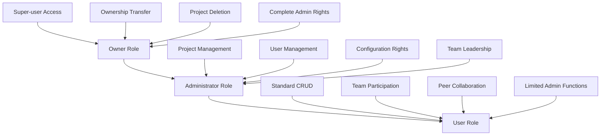
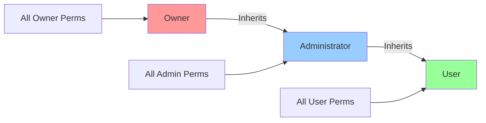
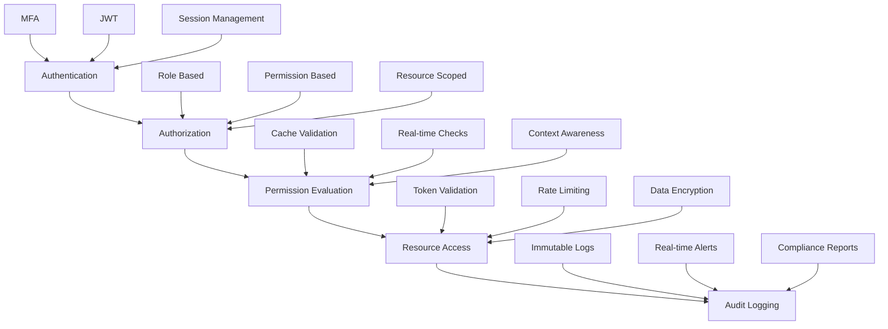

# Comprehensive Role-Based Access Control Architecture
## Lineage System Enhancement Specification

**Version:** 1.0  
**Author:** Architecture Team  
**Date:** 2025-11-23  
**Status:** Design Specification  

---

## Executive Summary

This specification defines a comprehensive role-based access control (RBAC) architecture for the Lineage system, implementing a three-tier role hierarchy with granular permissions, resource-scoped access control, and enhanced collaboration features. The design addresses existing limitations in the dual role system and provides a scalable foundation for enterprise-level security and collaboration.

## Table of Contents

1. [System Overview](#1-system-overview)
2. [Role Hierarchy Design](#2-role-hierarchy-design)
3. [Permission System Architecture](#3-permission-system-architecture)
4. [Database Schema Design](#4-database-schema-design)
5. [API Contract Design](#5-api-contract-design)
6. [Security Integration](#6-security-integration)
7. [Implementation Strategy](#7-implementation-strategy)
8. [Migration Plan](#8-migration-plan)
9. [Security Audit Framework](#9-security-audit-framework)
10. [Performance Optimization](#10-performance-optimization)

---

## 1. System Overview

### 1.1 Current State Analysis

The existing Lineage system demonstrates:

- **Dual Role Confusion**: Overlapping `User.globalRole` and `ProjectRole` systems
- **Limited Granularity**: Basic 3-4 role hierarchy without fine-grained permissions
- **Service-Level Authorization**: Access control scattered across service implementations
- **Missing Collaboration Features**: No team management, task assignment, or peer review capabilities
- **Underutilized JSONB**: Database permissions field exists but isn't fully utilized

### 1.2 Target Architecture

The proposed architecture implements:

- **Clear 3-Tier Hierarchy**: Owner → Administrator → User with defined escalation paths
- **Granular Permission System**: JSONB-based permissions with resource scoping
- **Centralized Authorization**: Dedicated permission evaluation service
- **Enhanced Collaboration**: Team structures, task assignment, peer reviews
- **Backward Compatibility**: Seamless migration from existing systems

---

## 2. Role Hierarchy Design

### 2.1 Three-Tier Role Structure



### 2.2 Role Definitions

#### 2.2.1 Owner Role
**Characteristics:**
- Super-user with complete project control
- Exclusive authority for ownership transfer and project deletion
- Full administrative privileges across all projects
- System-level access with no restrictions

**Exclusive Permissions:**
- `ownership.transfer` - Transfer project ownership to another user
- `project.delete` - Delete entire projects and all associated data
- `system.administer` - Full system administration access
- `user.demote_owner` - Remove owner role from any user

#### 2.2.2 Administrator Role  
**Characteristics:**
- Comprehensive project management excluding owner-only functions
- User management operations
- Configuration management
- Team leadership and coordination

**Key Permissions:**
- `user.create`, `user.read`, `user.update`, `user.delete`, `user.manage`
- `role.create`, `role.read`, `role.update`, `role.delete`, `role.manage`
- `project.create`, `project.read`, `project.update`, `project.manage`
- `requirement.create`, `requirement.read`, `requirement.update`, `requirement.delete`, `requirement.manage`
- `team.manage`, `team.invite`, `team.remove`, `team.configure`

#### 2.2.3 User Role
**Characteristics:**
- Standard participant access with CRUD operation capabilities
- Restricted from administrative functions
- Team collaboration and peer review capabilities
- Limited project configuration access

**Core Permissions:**
- `project.read`, `requirement.create`, `requirement.read`, `requirement.update`
- `team.participate`, `peer.review`, `task.assign`, `task.complete`
- `comment.create`, `comment.read`, `comment.update`
- `collaboration.request`, `workflow.participate`

### 2.3 Permission Inheritance Rules



**Inheritance Hierarchy:**
- **Owner** inherits all Administrator permissions + exclusive owner permissions
- **Administrator** inherits all User permissions + administrative permissions  
- **User** has base-level permissions without administrative privileges

---

## 3. Permission System Architecture

### 3.1 Permission Granularity Framework

#### 3.1.1 Permission Structure
```json
{
  "resource": "project",
  "action": "create",
  "scope": "global|project",
  "conditions": {
    "project_id": "uuid",
    "ownership": "required|optional",
    "team_membership": "required|optional"
  }
}
```

#### 3.1.2 Resource Categories

**Core Resources:**
- `user` - User account management
- `role` - Role and permission management
- `project` - Project lifecycle management
- `requirement` - Requirement creation and management
- `audit` - Audit log access and management

**Collaboration Resources:**
- `team` - Team structure and membership
- `task` - Task assignment and tracking
- `review` - Peer review processes
- `comment` - Comment and discussion threads
- `notification` - Notification management

**System Resources:**
- `system` - System configuration and administration
- `integration` - Third-party integrations
- `export` - Data export and reporting
- `backup` - Backup and recovery operations

### 3.2 Permission Matrix

| Resource | Action | Owner | Administrator | User |
|----------|--------|-------|---------------|------|
| **Project Management** |
| project | create | ✅ | ✅ | ❌ |
| project | read | ✅ | ✅ | ✅ |
| project | update | ✅ | ✅ | ❌ |
| project | delete | ✅ | ❌ | ❌ |
| project | manage | ✅ | ✅ | ❌ |
| project | transfer_ownership | ✅ | ❌ | ❌ |
| **User Management** |
| user | create | ✅ | ✅ | ❌ |
| user | read | ✅ | ✅ | ✅ |
| user | update | ✅ | ✅ | ❌ |
| user | delete | ✅ | ❌ | ❌ |
| user | manage | ✅ | ✅ | ❌ |
| **Role Management** |
| role | create | ✅ | ✅ | ❌ |
| role | read | ✅ | ✅ | ✅ |
| role | update | ✅ | ✅ | ❌ |
| role | delete | ✅ | ❌ | ❌ |
| role | manage | ✅ | ✅ | ❌ |
| **Requirement Management** |
| requirement | create | ✅ | ✅ | ✅ |
| requirement | read | ✅ | ✅ | ✅ |
| requirement | update | ✅ | ✅ | ✅ |
| requirement | delete | ✅ | ✅ | ❌ |
| requirement | manage | ✅ | ✅ | ❌ |
| **Team Collaboration** |
| team | manage | ✅ | ✅ | ❌ |
| team | invite | ✅ | ✅ | ✅ |
| team | participate | ✅ | ✅ | ✅ |
| task | assign | ✅ | ✅ | ✅ |
| task | complete | ✅ | ✅ | ✅ |
| review | conduct | ✅ | ✅ | ✅ |
| **System Administration** |
| system | configure | ✅ | ❌ | ❌ |
| system | monitor | ✅ | ✅ | ❌ |
| audit | read | ✅ | ✅ | ❌ |
| audit | manage | ✅ | ❌ | ❌ |

### 3.3 Resource-Scoped Permissions

#### 3.3.1 Project Scoping
Permissions can be scoped to specific projects:

```json
{
  "permission": "project.manage",
  "scopes": [
    {
      "type": "project",
      "resource_id": "project-uuid-1",
      "granted": true
    },
    {
      "type": "project", 
      "resource_id": "project-uuid-2",
      "granted": false
    }
  ]
}
```

#### 3.3.2 Conditional Permissions
Dynamic permission evaluation based on context:

```json
{
  "permission": "project.delete",
  "conditions": [
    {
      "type": "ownership",
      "operator": "equals",
      "value": "current_user"
    },
    {
      "type": "confirmation",
      "operator": "requires",
      "value": "explicit_deletion_confirmation"
    }
  ]
}
```

---

## 4. Database Schema Design

### 4.1 Enhanced Roles Schema

#### 4.1.1 Updated Roles Table
```sql
ALTER TABLE roles 
ADD COLUMN IF NOT EXISTS hierarchy_level INTEGER DEFAULT 1,
ADD COLUMN IF NOT EXISTS inheritance_path UUID[],
ADD COLUMN IF NOT EXISTS escalation_rules JSONB DEFAULT '{}',
ADD COLUMN IF NOT EXISTS collaboration_permissions JSONB DEFAULT '{}',
ADD COLUMN IF NOT EXISTS temporary_permissions JSONB DEFAULT '{}';

-- Update existing roles with hierarchy
UPDATE roles SET hierarchy_level = CASE
    WHEN name = 'OWNER' THEN 3
    WHEN name = 'ADMINISTRATOR' THEN 2  
    WHEN name = 'USER' THEN 1
    ELSE hierarchy_level
END;

-- Create indexes for performance
CREATE INDEX IF NOT EXISTS idx_roles_hierarchy_level ON roles(hierarchy_level);
CREATE INDEX IF NOT EXISTS idx_roles_type_hierarchy ON roles(type, hierarchy_level);
```

#### 4.1.2 Permission Definitions Table
```sql
CREATE TABLE IF NOT EXISTS permission_definitions (
    id UUID PRIMARY KEY DEFAULT gen_random_uuid(),
    permission_key VARCHAR(100) NOT NULL UNIQUE,
    resource VARCHAR(50) NOT NULL,
    action VARCHAR(50) NOT NULL,
    description TEXT,
    category VARCHAR(50),
    requires_confirmation BOOLEAN DEFAULT FALSE,
    audit_required BOOLEAN DEFAULT TRUE,
    is_system BOOLEAN DEFAULT FALSE,
    created_at TIMESTAMP DEFAULT NOW(),
    updated_at TIMESTAMP DEFAULT NOW()
);

-- Insert standard permissions
INSERT INTO permission_definitions (permission_key, resource, action, description, category) VALUES
-- Project Management
('project.create', 'project', 'create', 'Create new projects', 'project_management'),
('project.read', 'project', 'read', 'View project details', 'project_management'),
('project.update', 'project', 'update', 'Modify project properties', 'project_management'),
('project.delete', 'project', 'delete', 'Delete projects', 'project_management'),
('project.manage', 'project', 'manage', 'Full project administration', 'project_management'),
('project.transfer_ownership', 'project', 'transfer_ownership', 'Transfer project ownership', 'project_management'),

-- User Management  
('user.create', 'user', 'create', 'Create user accounts', 'user_management'),
('user.read', 'user', 'read', 'View user information', 'user_management'),
('user.update', 'user', 'update', 'Modify user profiles', 'user_management'),
('user.delete', 'user', 'delete', 'Delete user accounts', 'user_management'),
('user.manage', 'user', 'manage', 'Full user administration', 'user_management'),

-- Role Management
('role.create', 'role', 'create', 'Create new roles', 'role_management'),
('role.read', 'role', 'read', 'View role definitions', 'role_management'),
('role.update', 'role', 'update', 'Modify role permissions', 'role_management'),
('role.delete', 'role', 'delete', 'Delete role definitions', 'role_management'),
('role.manage', 'role', 'manage', 'Full role administration', 'role_management'),

-- Team Collaboration
('team.manage', 'team', 'manage', 'Manage team structures', 'collaboration'),
('team.invite', 'team', 'invite', 'Invite team members', 'collaboration'),
('team.participate', 'team', 'participate', 'Participate in teams', 'collaboration'),
('task.assign', 'task', 'assign', 'Assign tasks to team members', 'collaboration'),
('task.complete', 'task', 'complete', 'Complete assigned tasks', 'collaboration'),
('peer.review', 'review', 'conduct', 'Conduct peer reviews', 'collaboration');

CREATE INDEX IF NOT EXISTS idx_permission_definitions_resource ON permission_definitions(resource);
CREATE INDEX IF NOT EXISTS idx_permission_definitions_category ON permission_definitions(category);
```

### 4.2 Team Management Schema

#### 4.2.1 Teams Table
```sql
CREATE TABLE IF NOT EXISTS teams (
    id UUID PRIMARY KEY DEFAULT gen_random_uuid(),
    name VARCHAR(100) NOT NULL,
    description TEXT,
    project_id UUID REFERENCES projects(id) ON DELETE CASCADE,
    created_by UUID NOT NULL REFERENCES users(id),
    is_active BOOLEAN DEFAULT TRUE,
    settings JSONB DEFAULT '{}',
    created_at TIMESTAMP DEFAULT NOW(),
    updated_at TIMESTAMP DEFAULT NOW(),
    UNIQUE(project_id, name)
);

CREATE INDEX IF NOT EXISTS idx_teams_project_id ON teams(project_id);
CREATE INDEX IF NOT EXISTS idx_teams_created_by ON teams(created_by);
```

#### 4.2.2 Team Members Table
```sql
CREATE TABLE IF NOT EXISTS team_members (
    id UUID PRIMARY KEY DEFAULT gen_random_uuid(),
    team_id UUID NOT NULL REFERENCES teams(id) ON DELETE CASCADE,
    user_id UUID NOT NULL REFERENCES users(id) ON DELETE CASCADE,
    role VARCHAR(50) DEFAULT 'member',
    permissions JSONB DEFAULT '{}',
    joined_at TIMESTAMP DEFAULT NOW(),
    invited_by UUID REFERENCES users(id),
    status VARCHAR(20) DEFAULT 'active' CHECK (status IN ('active', 'inactive', 'pending')),
    UNIQUE(team_id, user_id)
);

CREATE INDEX IF NOT EXISTS idx_team_members_team_id ON team_members(team_id);
CREATE INDEX IF NOT EXISTS idx_team_members_user_id ON team_members(user_id);
```

#### 4.2.3 Task Assignments Table
```sql
CREATE TABLE IF NOT EXISTS task_assignments (
    id UUID PRIMARY KEY DEFAULT gen_random_uuid(),
    task_title VARCHAR(255) NOT NULL,
    task_description TEXT,
    assigned_by UUID NOT NULL REFERENCES users(id),
    assigned_to UUID NOT NULL REFERENCES users(id),
    project_id UUID REFERENCES projects(id) ON DELETE CASCADE,
    requirement_id UUID REFERENCES requirements(id) ON DELETE SET NULL,
    status VARCHAR(20) DEFAULT 'assigned' CHECK (status IN ('assigned', 'in_progress', 'completed', 'cancelled')),
    priority VARCHAR(20) DEFAULT 'medium' CHECK (priority IN ('low', 'medium', 'high', 'critical')),
    due_date TIMESTAMP,
    completed_at TIMESTAMP,
    notes TEXT,
    created_at TIMESTAMP DEFAULT NOW(),
    updated_at TIMESTAMP DEFAULT NOW()
);

CREATE INDEX IF NOT EXISTS idx_task_assignments_assigned_to ON task_assignments(assigned_to);
CREATE INDEX IF NOT EXISTS idx_task_assignments_project_id ON task_assignments(project_id);
CREATE INDEX IF NOT EXISTS idx_task_assignments_status ON task_assignments(status);
CREATE INDEX IF NOT EXISTS idx_task_assignments_due_date ON task_assignments(due_date);
```

### 4.3 Peer Review Schema

#### 4.3.1 Peer Reviews Table
```sql
CREATE TABLE IF NOT EXISTS peer_reviews (
    id UUID PRIMARY KEY DEFAULT gen_random_uuid(),
    requirement_id UUID NOT NULL REFERENCES requirements(id) ON DELETE CASCADE,
    reviewer_id UUID NOT NULL REFERENCES users(id),
    author_id UUID NOT NULL REFERENCES users(id),
    status VARCHAR(20) DEFAULT 'pending' CHECK (status IN ('pending', 'approved', 'rejected', 'revision_requested')),
    comments TEXT,
    review_details JSONB DEFAULT '{}',
    score INTEGER CHECK (score >= 1 AND score <= 5),
    reviewed_at TIMESTAMP,
    created_at TIMESTAMP DEFAULT NOW(),
    updated_at TIMESTAMP DEFAULT NOW(),
    UNIQUE(requirement_id, reviewer_id)
);

CREATE INDEX IF NOT EXISTS idx_peer_reviews_requirement_id ON peer_reviews(requirement_id);
CREATE INDEX IF NOT EXISTS idx_peer_reviews_reviewer_id ON peer_reviews(reviewer_id);
CREATE INDEX IF NOT EXISTS idx_peer_reviews_status ON peer_reviews(status);
```

### 4.4 Permission Audit Schema

#### 4.4.1 Permission Changes Table
```sql
CREATE TABLE IF NOT EXISTS permission_changes (
    id UUID PRIMARY KEY DEFAULT gen_random_uuid(),
    user_id UUID NOT NULL REFERENCES users(id),
    changed_by UUID NOT NULL REFERENCES users(id),
    permission_key VARCHAR(100) NOT NULL,
    old_value JSONB,
    new_value JSONB,
    resource_id UUID,
    reason TEXT,
    approved BOOLEAN DEFAULT TRUE,
    change_type VARCHAR(20) DEFAULT 'grant' CHECK (change_type IN ('grant', 'revoke', 'modify')),
    effective_from TIMESTAMP DEFAULT NOW(),
    effective_until TIMESTAMP,
    created_at TIMESTAMP DEFAULT NOW()
);

CREATE INDEX IF NOT EXISTS idx_permission_changes_user_id ON permission_changes(user_id);
CREATE INDEX IF NOT EXISTS idx_permission_changes_permission_key ON permission_changes(permission_key);
CREATE INDEX IF NOT EXISTS idx_permission_changes_effective_from ON permission_changes(effective_from);
```

---

## 5. API Contract Design

### 5.1 Role Management APIs

#### 5.1.1 GET /api/rbac/roles
Retrieve all available roles with their permissions.

**Response:**
```json
{
  "data": [
    {
      "id": "role-uuid",
      "name": "OWNER",
      "description": "Super-user with complete project control",
      "type": "GLOBAL",
      "hierarchy_level": 3,
      "permissions": [
        "project.create",
        "project.delete",
        "user.manage",
        "role.manage"
      ],
      "is_system": true
    }
  ],
  "metadata": {
    "total": 3,
    "page": 1,
    "size": 10
  }
}
```

#### 5.1.2 POST /api/rbac/roles
Create a new role definition.

**Request:**
```json
{
  "name": "PROJECT_MODERATOR",
  "description": "Project content moderator",
  "type": "PROJECT",
  "hierarchy_level": 1,
  "permissions": [
    "requirement.read",
    "requirement.update",
    "comment.moderate"
  ],
  "inheritance_path": ["USER"]
}
```

#### 5.1.3 PUT /api/rbac/roles/{roleId}
Update role permissions and properties.

#### 5.1.4 DELETE /api/rbac/roles/{roleId}
Delete a role (system roles cannot be deleted).

### 5.2 User Permission APIs

#### 5.2.1 GET /api/rbac/users/{userId}/permissions
Get current user's permissions with resource scoping.

**Response:**
```json
{
  "user_id": "user-uuid",
  "global_permissions": [
    "user.read",
    "project.read",
    "requirement.create"
  ],
  "project_permissions": [
    {
      "project_id": "project-uuid",
      "project_name": "My Project",
      "permissions": [
        "project.manage",
        "team.manage"
      ]
    }
  ],
  "effective_permissions": [
    "user.read",
    "project.read",
    "project.manage",
    "requirement.create",
    "team.manage"
  ]
}
```

#### 5.2.2 POST /api/rbac/users/{userId}/permissions/grant
Grant specific permissions to a user.

**Request:**
```json
{
  "permissions": [
    {
      "permission_key": "project.create",
      "scope": "global"
    },
    {
      "permission_key": "team.manage", 
      "scope": "project",
      "resource_id": "project-uuid"
    }
  ],
  "reason": "User promoted to project manager",
  "temporary": false,
  "expires_at": null
}
```

### 5.3 Team Management APIs

#### 5.3.1 GET /api/teams
List teams accessible to current user.

#### 5.3.2 POST /api/teams
Create a new team.

**Request:**
```json
{
  "name": "Frontend Development Team",
  "description": "Responsible for frontend development",
  "project_id": "project-uuid",
  "settings": {
    "auto_assign_reviewers": true,
    "require_peer_review": true
  }
}
```

#### 5.3.3 POST /api/teams/{teamId}/members/invite
Invite user to team.

### 5.4 Task Assignment APIs

#### 5.4.1 GET /api/tasks
List tasks assigned to current user.

#### 5.4.2 POST /api/tasks
Create a new task assignment.

**Request:**
```json
{
  "task_title": "Implement user authentication",
  "task_description": "Create login and registration components",
  "assigned_to": "user-uuid",
  "project_id": "project-uuid", 
  "requirement_id": "requirement-uuid",
  "priority": "high",
  "due_date": "2025-12-15T17:00:00Z"
}
```

#### 5.4.3 PUT /api/tasks/{taskId}/complete
Mark task as completed.

### 5.5 Permission Evaluation APIs

#### 5.5.1 POST /api/rbac/permissions/evaluate
Evaluate permissions for a specific action.

**Request:**
```json
{
  "user_id": "user-uuid",
  "permission": "project.delete",
  "resource_id": "project-uuid",
  "context": {
    "is_owner": false,
    "project_role": "ADMIN"
  }
}
```

**Response:**
```json
{
  "authorized": false,
  "reason": "insufficient_permissions",
  "missing_permissions": ["project.delete"],
  "user_permissions": ["project.read", "project.update"],
  "required_permissions": ["project.delete"]
}
```

---

## 6. Security Integration

### 6.1 JWT Claims Enhancement

#### 6.1.1 Extended JWT Structure
```json
{
  "sub": "user-email",
  "user_id": "uuid",
  "email": "user@example.com",
  "role": "ADMINISTRATOR",
  "permissions": [
    "user.read",
    "project.manage", 
    "team.manage"
  ],
  "scoped_permissions": [
    {
      "resource_type": "project",
      "resource_id": "project-uuid",
      "permissions": ["project.manage", "team.manage"]
    }
  ],
  "team_memberships": [
    {
      "team_id": "team-uuid",
      "role": "member",
      "permissions": ["team.participate"]
    }
  ],
  "iat": 1634567890,
  "exp": 1634654290
}
```

#### 6.1.2 Permission Caching Strategy
- Cache user permissions in JWT to reduce database calls
- Implement permission cache with configurable TTL
- Provide cache invalidation endpoints for admin users
- Support real-time permission updates via WebSocket

### 6.2 Method-Level Security

#### 6.2.1 Custom Annotations
```java
@Target({ElementType.METHOD, ElementType.TYPE})
@Retention(RetentionPolicy.RUNTIME)
public @interface RequirePermission {
    String value();
    String resourceId() default "";
    boolean requireConfirmation() default false;
}

@Target({ElementType.METHOD, ElementType.TYPE})
@Retention(RetentionPolicy.RUNTIME)  
public @interface RequireRole {
    RoleType[] value();
}
```

#### 6.2.2 Service Layer Security
```java
@Service
public class ProjectService {
    
    @RequirePermission("project.delete")
    public void deleteProject(UUID projectId) {
        // Implementation
    }
    
    @RequirePermission("project.manage")
    @RequireConfirmation
    public void transferOwnership(UUID projectId, UUID newOwnerId) {
        // Implementation  
    }
}
```

### 6.3 Permission Evaluation Service

#### 6.3.1 Core Interface
```java
@Service
public interface PermissionEvaluationService {
    
    /**
     * Check if user has specific permission
     */
    boolean hasPermission(UUID userId, String permissionKey, UUID resourceId);
    
    /**
     * Get all effective permissions for user
     */
    Set<String> getEffectivePermissions(UUID userId, UUID resourceId);
    
    /**
     * Evaluate permission with context
     */
    PermissionEvaluationResult evaluatePermission(UUID userId, String permissionKey, 
                                                  UUID resourceId, Map<String, Object> context);
    
    /**
     * Check role hierarchy
     */
    boolean hasRoleOrHigher(UUID userId, RoleType role);
}
```

#### 6.3.2 Performance Optimization
- Implement permission cache with LRU eviction
- Use database query optimization for permission lookups
- Batch permission evaluations for bulk operations
- Implement async permission validation for non-critical operations

---

## 7. Implementation Strategy

### 7.1 Phase 1: Foundation (Weeks 1-3)

#### 7.1.1 Database Schema Updates
- [ ] Create enhanced roles table with hierarchy
- [ ] Implement permission definitions table  
- [ ] Add team management tables
- [ ] Create task assignment tables
- [ ] Add peer review tables
- [ ] Implement permission audit tables

#### 7.1.2 Core Services
- [ ] Develop PermissionEvaluationService
- [ ] Create RoleManagementService
- [ ] Implement TeamManagementService
- [ ] Build TaskAssignmentService

#### 7.1.3 Basic APIs
- [ ] Role management endpoints
- [ ] Permission evaluation endpoints
- [ ] Basic team management APIs

### 7.2 Phase 2: Enhancement (Weeks 4-6)

#### 7.2.1 Security Integration
- [ ] Extend JWT claims for enhanced permissions
- [ ] Implement method-level security annotations
- [ ] Create permission caching layer
- [ ] Add real-time permission updates

#### 7.2.2 Advanced Features
- [ ] Peer review system implementation
- [ ] Task assignment and tracking
- [ ] Team collaboration features
- [ ] Notification system integration

#### 7.2.3 Testing
- [ ] Unit tests for all permission evaluation logic
- [ ] Integration tests for API endpoints
- [ ] Security testing for authorization bypass attempts
- [ ] Performance testing for permission lookups

### 7.3 Phase 3: Integration (Weeks 7-9)

#### 7.3.1 Migration
- [ ] Data migration scripts from dual role system
- [ ] Backward compatibility layer
- [ ] Gradual rollout with feature flags
- [ ] Rollback procedures

#### 7.3.2 Frontend Integration
- [ ] Update UI components for new role system
- [ ] Implement permission-based UI rendering
- [ ] Add team management interfaces
- [ ] Create task assignment UI

#### 7.3.3 Documentation
- [ ] API documentation with examples
- [ ] Security best practices guide
- [ ] Migration guide for administrators
- [ ] Developer integration guide

### 7.4 Phase 4: Optimization (Weeks 10-12)

#### 7.4.1 Performance
- [ ] Database query optimization
- [ ] Permission cache tuning
- [ ] API response time optimization
- [ ] Memory usage optimization

#### 7.4.2 Monitoring
- [ ] Permission evaluation metrics
- [ ] Security event monitoring
- [ ] Performance monitoring dashboards
- [ ] Audit trail reporting

#### 7.4.3 Final Testing
- [ ] Load testing with realistic permission scenarios
- [ ] Security penetration testing
- [ ] User acceptance testing
- [ ] Documentation review and validation

---

## 8. Migration Plan

### 8.1 Migration Strategy

#### 8.1.1 Backward Compatibility Approach
The migration maintains full backward compatibility while introducing the new system:

1. **Dual System Period**: Both old and new systems operate simultaneously
2. **Gradual Migration**: Users and roles migrate incrementally
3. **Data Validation**: Comprehensive checks ensure data integrity
4. **Rollback Capability**: Full rollback procedures at each phase

#### 8.1.2 Migration Phases

**Phase 1: Schema Migration**
```sql
-- Add new columns to existing tables
ALTER TABLE roles ADD COLUMN hierarchy_level INTEGER DEFAULT 1;
ALTER TABLE roles ADD COLUMN permission_inheritance JSONB DEFAULT '[]';

-- Update existing role mappings
UPDATE roles SET hierarchy_level = CASE
    WHEN name = 'ADMIN' THEN 3
    WHEN name = 'PROJECT_MANAGER' THEN 2
    WHEN name = 'DEVELOPER' THEN 1
    WHEN name = 'VIEWER' THEN 1
    ELSE hierarchy_level
END;

-- Insert new permission definitions
INSERT INTO permission_definitions (permission_key, resource, action, description)
SELECT permission, resource, action, description FROM (
    VALUES 
    ('project.create', 'project', 'create', 'Create new projects'),
    ('project.read', 'project', 'read', 'View project details'),
    ('project.update', 'project', 'update', 'Modify project properties'),
    ('project.delete', 'project', 'delete', 'Delete projects'),
    ('project.manage', 'project', 'manage', 'Full project administration')
) AS new_permissions(permission, resource, action, description)
ON CONFLICT (permission_key) DO NOTHING;
```

**Phase 2: Data Migration**
```sql
-- Migrate existing user roles to new structure
WITH role_mapping AS (
    SELECT 
        ur.user_id,
        CASE 
            WHEN r.name = 'ADMIN' THEN 'OWNER'
            WHEN r.name = 'PROJECT_MANAGER' THEN 'ADMINISTRATOR'
            WHEN r.name = 'DEVELOPER' THEN 'USER'
            WHEN r.name = 'VIEWER' THEN 'USER'
            ELSE r.name
        END as new_role_name,
        ur.project_id,
        ur.granted_at
    FROM user_roles ur
    JOIN roles r ON ur.role_id = r.id
)
INSERT INTO user_roles_new (user_id, role_id, scope, granted_at, is_active)
SELECT 
    rm.user_id,
    r.id as role_id,
    COALESCE(rm.project_id IS NOT NULL, false)::varchar(20) || '_MIGRATED' as scope,
    rm.granted_at,
    true as is_active
FROM role_mapping rm
JOIN roles r ON r.name = rm.new_role_name AND r.type = 'GLOBAL'
WHERE NOT EXISTS (
    SELECT 1 FROM user_roles_new urn 
    WHERE urn.user_id = rm.user_id AND urn.role_id = r.id
);
```

**Phase 3: Application Migration**
- Implement new permission evaluation service alongside existing
- Add compatibility layer for old role references
- Enable feature flags for gradual rollout
- Monitor migration progress and user feedback

### 8.2 Rollback Procedures

#### 8.2.1 Database Rollback
```sql
-- Restore original roles structure
DROP TABLE IF EXISTS permission_changes;
DROP TABLE IF EXISTS peer_reviews;
DROP TABLE IF EXISTS task_assignments;
DROP TABLE IF EXISTS team_members;
DROP TABLE IF EXISTS teams;
DROP TABLE IF EXISTS permission_definitions;

-- Restore original roles table
ALTER TABLE roles DROP COLUMN IF EXISTS hierarchy_level;
ALTER TABLE roles DROP COLUMN IF EXISTS inheritance_path;
ALTER TABLE roles DROP COLUMN IF EXISTS escalation_rules;
```

#### 8.2.2 Application Rollback
- Disable new RBAC features via configuration
- Restore old authorization logic
- Clear permission caches
- Restart application services

---

## 9. Security Audit Framework

### 9.1 Security Audit Requirements

#### 9.1.1 Compliance Requirements
- **SOX Compliance**: All permission changes must be auditable
- **GDPR Compliance**: User data access must be logged
- **ISO 27001**: Access control security standards
- **NIST Framework**: Cybersecurity framework alignment

#### 9.1.2 Audit Events
```sql
CREATE TABLE security_audit_events (
    id UUID PRIMARY KEY DEFAULT gen_random_uuid(),
    event_type VARCHAR(50) NOT NULL,
    user_id UUID,
    target_user_id UUID,
    resource_type VARCHAR(50),
    resource_id UUID,
    action VARCHAR(100),
    details JSONB DEFAULT '{}',
    ip_address INET,
    user_agent TEXT,
    session_id VARCHAR(255),
    severity VARCHAR(20) DEFAULT 'INFO',
    outcome VARCHAR(20) DEFAULT 'SUCCESS',
    created_at TIMESTAMP DEFAULT NOW()
);
```

### 9.2 Threat Modeling

#### 9.2.1 Attack Vectors
1. **Privilege Escalation**: Users attempting to gain higher permissions
2. **Authorization Bypass**: Circumventing permission checks
3. **Session Hijacking**: Unauthorized access through token theft
4. **Permission Mining**: Enumerating user permissions
5. **Resource Access**: Unauthorized access to project resources

#### 9.2.2 Mitigation Strategies


### 9.3 Security Monitoring

#### 9.3.1 Real-time Alerts
- Failed authorization attempts
- Permission escalation attempts
- Unusual access patterns
- Bulk permission queries
- Failed authentication attempts

#### 9.3.2 Security Metrics
```java
@Component
public class SecurityMetrics {
    
    @EventListener
    public void handleAuthorizationFailure(AuthorizationFailureEvent event) {
        // Track failed authorization attempts
        meterRegistry.counter("security.authorization.failures")
            .increment();
    }
    
    @EventListener
    public void handlePermissionChange(PermissionChangeEvent event) {
        // Track permission changes
        meterRegistry.counter("security.permission.changes")
            .tag("permission", event.getPermissionKey())
            .tag("change_type", event.getChangeType())
            .increment();
    }
}
```

---

## 10. Performance Optimization

### 10.1 Database Optimization

#### 10.1.1 Indexing Strategy
```sql
-- Permission lookup optimization
CREATE INDEX CONCURRENTLY idx_user_roles_permissions_composite 
ON user_roles(user_id, role_id, scope, is_active);

-- Hierarchical role queries
CREATE INDEX CONCURRENTLY idx_roles_hierarchy_composite 
ON roles(type, hierarchy_level, is_active);

-- Audit query optimization  
CREATE INDEX CONCURRENTLY idx_audit_events_composite 
ON security_audit_events(event_type, user_id, created_at);

-- Team membership queries
CREATE INDEX CONCURRENTLY idx_team_members_composite 
ON team_members(team_id, user_id, status);
```

#### 10.1.2 Query Optimization
- Use materialized views for complex permission aggregations
- Implement query result caching for frequently accessed permissions
- Use database connection pooling for high-throughput scenarios
- Optimize join patterns for role hierarchy queries

### 10.2 Application-Level Optimization

#### 10.2.1 Caching Strategy
```java
@Service
public class PermissionCacheService {
    
    @Cacheable(value = "userPermissions", key = "#userId")
    public Set<String> getUserPermissions(UUID userId) {
        return permissionRepository.findEffectivePermissions(userId);
    }
    
    @CacheEvict(value = "userPermissions", key = "#userId")
    public void evictUserPermissions(UUID userId) {
        // Cache invalidation logic
    }
    
    @CachePut(value = "roleHierarchy", key = "#roleType")
    public List<Role> refreshRoleHierarchy(RoleType roleType) {
        return roleRepository.findRoleHierarchy(roleType);
    }
}
```

#### 10.2.2 Async Processing
- Async permission validation for non-critical operations
- Background sync of permission changes across services
- Async audit logging to avoid blocking main operations
- Queue-based permission cache updates

### 10.3 Monitoring and Metrics

#### 10.3.1 Performance KPIs
- Permission evaluation latency (target: <10ms)
- Authorization success rate (target: >99.9%)
- Cache hit rate (target: >95%)
- Database query performance (target: <50ms for complex queries)
- API response times (target: <200ms for permission endpoints)

#### 10.3.2 Monitoring Dashboard
```yaml
# Prometheus metrics configuration
metrics:
  - name: permission_evaluation_duration
    type: histogram
    labels: [resource_type, permission_key]
  
  - name: authorization_requests_total
    type: counter
    labels: [outcome, user_role]
  
  - name: cache_hit_ratio
    type: gauge
    labels: [cache_name]
  
  - name: database_query_duration
    type: histogram
    labels: [query_type, table_name]
```

---

## Conclusion

This comprehensive RBAC architecture specification provides a robust foundation for implementing enterprise-grade role-based access control in the Lineage system. The design addresses current limitations while providing scalable mechanisms for future growth.

### Key Benefits

1. **Clear Hierarchy**: Three-tier role system with defined escalation paths
2. **Granular Permissions**: JSONB-based permission system with resource scoping
3. **Enhanced Collaboration**: Team management, task assignment, and peer review capabilities
4. **Security First**: Comprehensive audit trail and security monitoring
5. **Performance Optimized**: Caching strategies and database optimization
6. **Backward Compatible**: Seamless migration from existing systems

### Next Steps

1. Review and approve the technical specification
2. Begin Phase 1 implementation (database schema and core services)
3. Establish development timeline and resource allocation
4. Set up continuous integration and testing infrastructure
5. Plan stakeholder communication and training sessions

This specification serves as the definitive guide for the development team and will be updated throughout the implementation process to reflect lessons learned and emerging requirements.
